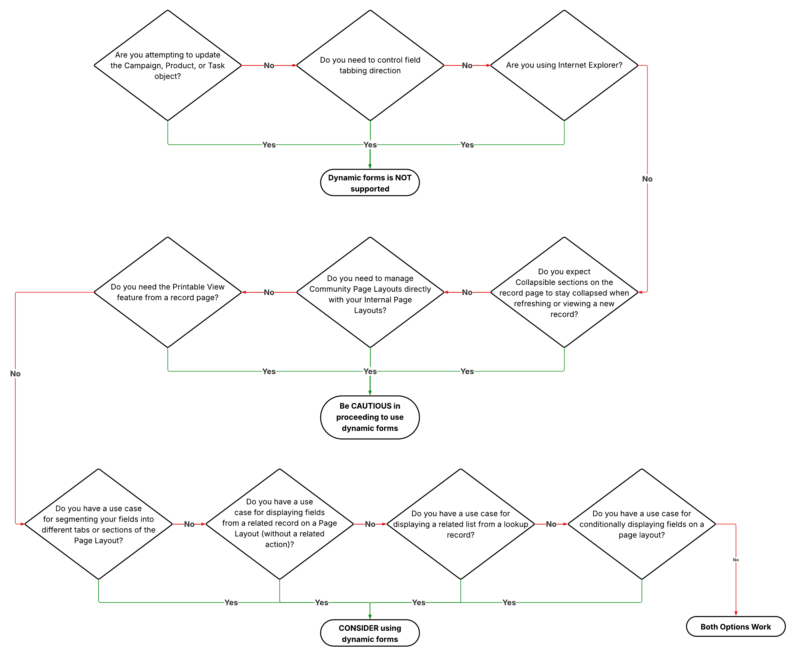

# Salesforce Page Layout Considerations

**Page Layout Considerations**

**Contributors**
- Erica Buckingham
- Tony Carollo
- Katie Chu
- Daniel Kwolkoski
- Christopher Littlefield
- Geoffrey Tennent

**Introduction**
As the information on your record page becomes complex, you need to determine the best way to present record information for each object. Will a default Lightning Record Page layout work for you or will you need to use Dynamic Forms and Dynamic Actions? This article provides guidance and improves clarity for Salesforce admins working with Page Layouts, Lightning Record Pages, and Dynamic Forms and Actions allowing for effective and informed decision making when considering which option to use for each object.

**Considerations**

| | **Default Lightning Record Page** | **Lightning Record Page with Dynamic Forms & Actions enabled** |
|---|---|---|
| **Description** | LRP using "Record Detail" component; dynamic forms and actions **are not** enabled | LRP with dynamic forms and actions enabled |
| **Benefits** | • Simpler management of page layout assignments   ◦ 1-1 when not customizing LRP | • Add fields from lookup records on the page • Segment fields into tabs • Conditional visibility available on   ◦ Single Fields   ◦ Actions   ◦ Sections   ◦ Components   ◦ Tabs • Add icons/colors to individual fields • Add any related list to record page • Add related lists from lookup objects |
| **Limitations** | • Related Lists must be on the classic page layout to show • Conditional visibility only available on   ◦ Sections   ◦ Components | • Not available on Campaign, Product, and Task objects • Not available for use in Experience Cloud • Highlights panel disappears when scrolling • Sections don't remain collapsed upon refresh • "Printable View" prints Classic Page Layout • Inability to preview as another user to test conditionality • Field Tabbing Direction not modifiable for data entry |
| **Gotchas** | • LRP customizations are in two places (see 'Where to make edits') • Page assignments are in two places:   ◦ Record Detail component dictated by page layout profile assignment   ◦ LRP visibility dictated by Org, App, Record Type, and Profile assignments • When using Single Related List component, selected related list must be on the Classic Page Layout • Updates to the LRP only works on Mobile if you enable "Dynamic Forms and Dynamic Highlights Panel on Mobile" setting in Salesforce Mobile App • Lots of conditional visibility can slow down screen loading | • For inline editing (List Views and Reports), field needs to be added to Classic Page Layout • "New" record screen uses Classic Page Layout (and therefore doesn't respect conditionality) • Conditional visibility:   ◦ Lots of conditional visibility can slow down screen loading   ◦ Does not support multi-select fields   ◦ Controlling field must be in the same section to work • Dynamic Forms only works on Mobile if you enable "Dynamic Forms and Dynamic Highlights Panel on Mobile" setting in Salesforce Mobile App |
| **Where to make edits** | **Classic Page Layout:** • Field placement • Field tabbing direction • Related Lists • Mobile Actions, Buttons, Links  **Page Layout Assignment** | **Lightning Record Page Editor:** • Tab labels and order • Lightning components • Single Related Lists (must be on Page Layout) • Conditional Visibility • Lightning Record Page Assignment  Everything controlled by the Lightning Record Page editor |

*subject to change in future Salesforce Releases

Decision tree to help you decide which form of Salesforce Page layout options is right for your use case.
