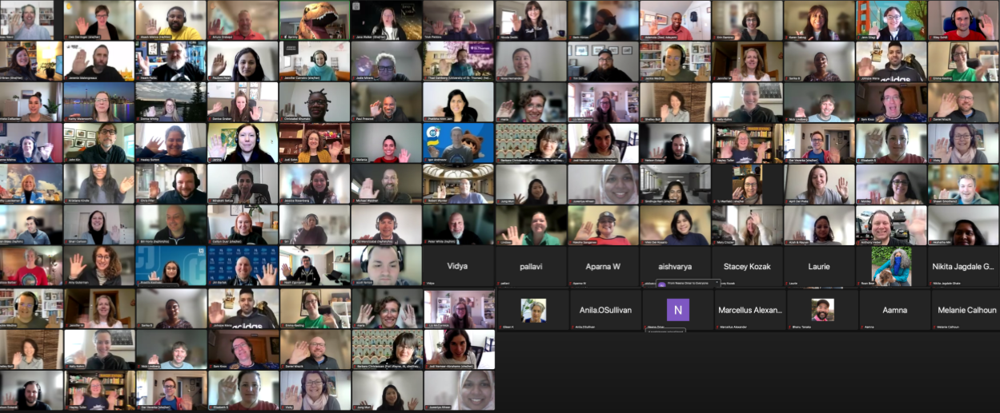

# We sprinted virtually, and the global community SHOWED UP!
### Dates: March 29 & 30th, 2023
### Location: Virtual

We were thrilled to gather our Nonprofit and Education community virtually for two days of brainstorming, creating impactful solutions, and fun networking to build community solutions for common challenges affecting Nonprofits and Schools. 

Within days of registration going live in January, we knew this one was going to be special. Within weeks we had over 200 attendees register to participate virtually alongside other Nonprofits, Schools, Salesforce.org Partners, and employees from all over the world. From Australia to Zimbabwe, we welcomed contributors from 14 countries. Thank you to all who stayed up late, woke up early, and spend time away from your day-job and family to spend time sharing your skills. 

## Check out the 12 community led projects that participated:

### Grassroots Mobile Survey App (GRMS) - Offline Capable Survey Tool for Nonprofits with Field Workers
GRMS is a Salesforce solution providing custom mobile survey capabilities to Nonprofits, enabling workers and volunteers in the field to collect program and service data anywhere, and easily sync critical data to their Salesforce platform. With the customizable Salesforce Package, Nonprofit Admins create and manage custom surveys, configure field workers and volunteer mobile app users, create and update records with survey data, and visualize survey results in reports and dashboards. A survey pack with sample fields for disaster relief and home healthcare use cases is included to get started fast.
Work performed at the Sprint:
- Added 3 languages for the backend of the app
- Had various new members install the app for UX and doc testing/proofreading
- Started on automation documentation and testing. 
- Fixed a Heroku issue

Next Steps:
- Improvie our automation docs and create more, source more languages!
- Work on misc doc updates
- Work more on Marketing

### Summit Events App (SEA) - Community built event management solution for Nonprofits and Schools
Summit Events App makes it easy for any Nonprofit or School to build custom events from Salesforce, and collect online registration information. SEA is a free add-on Salesforce package, making sophisticated event management tools more accessible than ever, with ann intentionally simple design that makes it easy for an organization's end-user to build a variety of event types, connect registrations to Contacts or Leaders, and share online registration forms to collect custom information tailored specifically to an event.
Work performed at the Sprint:
- Design Thinking on Waitlists: Covered the Registration experience as well as the Admin experience and overall desired functionality and expectations
- Meaingful discourse on waitlist solution design, flow and story boarding, wire frame development

Next Steps:
- Start creating build task for the full devleopment around waitlist, getting to the MVLS (Minimum Viable Lovable Solution)

### Declarative Lookup Rollup Summaries (DLRS) - User friendly wizard to understand relationships between different sets of data in Salesforce
DLRS is a popular free and open source package that includes an Admin-friendly interface to generate and manage APEX code to create cross-object roll-up summaries in your Salesforce org. As blogged by creator Andrew Fawcett aka Andy in the Cloud in 2013, DLRS has recently been contributed to and adopted by The Commons program. A new customer and partner community volunteer team has come together to make improvements and ensure it remains a trusted and sustainable solution for all. 
Work performed at the Sprint:
- Scoped the new LWC Editor and started on Dev Tasks (Dev)
- Documentation created tagging system for recipes, added new recipes and started to revise user guide. (Doc)
- Marketing set up medium and lastpass and draft release blog and QA documented testing and started creating object and rollups in a scratch org (Marketing)

Next Steps:
- Publish version 2.18

### Nonprofit Salesforce How-To Series - Community created videos demonstrating the features and best practices of Salesforce for Nonprofits products.
This ongoing official Commons community team creates very popular short, digestible Nonprofit Success Pack (NPSP) How-To videos from NPSP documentation. Videos created by volunteers on this team say over 65,000 views in 2022 alone, and over 200,000 since they began creating them in 2016!
Work performed at the Sprint:
- Designed, tested, validated (4) AI prompts for video content creators.
- Documented the AI prompts, pro-tips, examples, repositories, and resources.
- Wrote and edited new scripts in preperation for screen capture and recording.

Next Steps:
- Continue to partner with other Commons teams to product project focused overview video scripts.

### Sprinty’s Community Resources - Curated community content to help nonprofits find what they need, fast
Sprinty’s Community Resources (SCR) is an online library of relevant crowdsourced community content to help nonprofits and schools learn from their peers and get the information they need to get the most out of their Salesforce platform. Using a public Salesforce Experience portal, SCR provides an easy, searchable library of crowdsourced tips, best practices, and use case resources open to all nonprofit staff and consultants. SCR includes blog posts, Trailblazer Community conversations, videos, and more. Resources are submitted by community members and curated by the SCR project team.
Work performed at the Sprint:
- Built a draft of the functionality for end users to submit feedback on a resource (ie broken link)
- Approved over 100 new resources, bringing us to a total of 190 approved resources in the library!

Next Steps:
- Deploy the feedback flow.

### Data Generation Toolkit - Resources for generating realistic fake data sets to help admins build & test better
Team focused on creating resources such as recipes for generating realistic test data sets to help admins build better, often using Snowfakery (a CumulusCI tool). 
Work performed at the Sprint:
- Initiated Snowfakery support via crossed-project collaboration and performed Stakerholder interview and requirement gathering.

Next Steps:
- Continue to partner with other Commons teams to create recipes to deliver test data in scratch orgs via Snowfakery

### Salesforce Indicators - Open source Lightning Web Component to highlight key indicators on a Salesforce record
Salesforce Indicators is a new project team (created in 2022) to focus on building out an open source Lightning Web Component to highlight key indicators on a Salesforce record.
Work performed at the Sprint:
- Got new volunteers installed with Indicators and they all got started working.
- Documentation was cleaned up, and added a number of new receipies and use cases.
- Completed competitor reviews
- Identified a new bug to tackle

Next Steps:
- Minor fixes, tweaks, and then RELEASE!

### Grants Content Kit - App to store and organizes grant proposal content in Salesforce
The Grants Content Kit stores and organizes grant proposal content in Salesforce, allowing grant writers to streamline applications starting with their best content. Community leader Mary Crozier is leading this project to engage the community on the newly released Grant Content Kit.
Work performed at the Sprint:
- Collaborated on converting the GitHub repo to CCI, creating a managed packaged version, enabling multi-lingual support and developer documentation.
- Generated or edited example content/text for the default sections in the GCK
- Completed sample grant material, edited documentation files in github
- Moved the project towards using GitHub as the 1 source of truth for info about Grants Content Kit.

Next Steps:
- Continue to edit and refine the end-user documentation. Move some of the content into muliple pages in the GitHub Wiki for easier navigation.
- Reviews issues in github
- Marketing to promote the app

### Membership Schema And Benefits - App to help Nonprofits track their membership data more effectively
This Sprint project team is working to build a schema for memberships, sponsorship, renewals, payments, multiple members, families, benefits, etc., within Salesforce to help Nonprofits track their data more effectively.
Work performed at the Sprint:
- Onboarded 7 new volunteers - No Technical Issues (Yay!)
- Updated the setup instructions in the project wiki with links to resources
- Updated Data Dictionary
- Referenced existing resources for setup tasks (Trailhead etc.)
- Learned how Snowfakery can make our Testing lives easier (partnership with Data Generation Toolkit Team)
- Started mapping the user process for a membership transaction to determine where automation needs to be built. Fantastic conversation/debate on using Opportunity record types.

Next Steps:
- Complete the process map and begin building automation then testing, testing, testing!

### Sticky Selectron Lightning Web Component (LWC) - Datatable Lightning Component for working with multiple records in a screen flow
The Sticky Selectron project is focused on building a Datatable Lightning Component to extend the Program Management Module product that allows for easy selection of multiple records in a screen flow that will persist (or remain “sticky”) upon return to the record selection screen for any further modifications.
Work performed at the Sprint:
- We've been working on the main issues we'd like to address in our MVP which is listed on our [GitHub Issues page](https://github.com/SFDO-Community/sticky-selectron/issues).
- Worked on a formatting feature for Date/Time.
- Migrated our Issues to the new GitHub repo.
- Continued to research LWC config issue in screen flow.
- Started our GitHub Pages site.

Next Steps:
- Testing, and then RELEASE!

### App Advice and Consumer Reports Content Revamp - Trailblazer group dedicated to discussing non-profit-focused, third-party Salesforce apps and, historically, recommendations
This project is a legacy Community sourced list of commonly used Salesforce Apps by the Salesforce.org community that needs a revamp! The “App Advice and Consumer Reports” group in the Trailblazer Community (formerly from the Power of Us Hub) is 100% community created and maintained and could do with some updating.
Work performed at the Sprint:
- Determined structural changes to existing tools
- Planned for curating recommendations; Updating existing spreadsheets with langauge about outdated information.

Next Steps:
- Create parameters for recommendations and determine best platform to house this information

### Transfer Credit Equivalency - App to provide automation for transfer credit evaluation and course articulation from other schools
This project is working to document the challenges and potential solutions to transfer credit evaluation and course articulation. This project will develop a reference architecture that extends Education Data Architecture (EDA) to accommodate this use case.
Work performed at the Sprint:
- Updated the ERD to align with Education Data Architecture objects
- Continued building the screen flow for data collection; Added validation rules to the fields on the screen flow
- Began drafting an admin guide
- Began drafting a crosswalk between Education Data Architecture objects and Education Cloud objects
- Built out objects for Transcripts and Transcript Courses
- Added the Flow Component to the Contact’s Lightning Record Page

Next Steps:
- Complete the Flow to delete orphaned rules if/when a Plan Requirement is deleted.
- Get ready for packaging and release!

See, it was such a fantastic event and I hope to see you at the next one. 

## Don't miss our upcoming events! Join the [Commons & Sprints group](https://trailhead.salesforce.com/trailblazer-community/groups/0F94S000000GwVK#discussion) in the Trailblazer community and be the first to hear about where we'll be Sprinting next.

