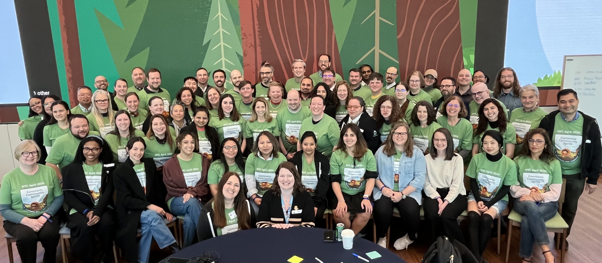
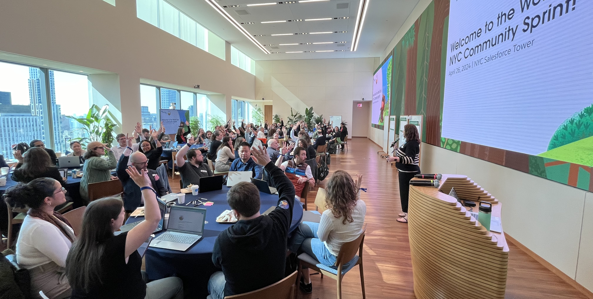
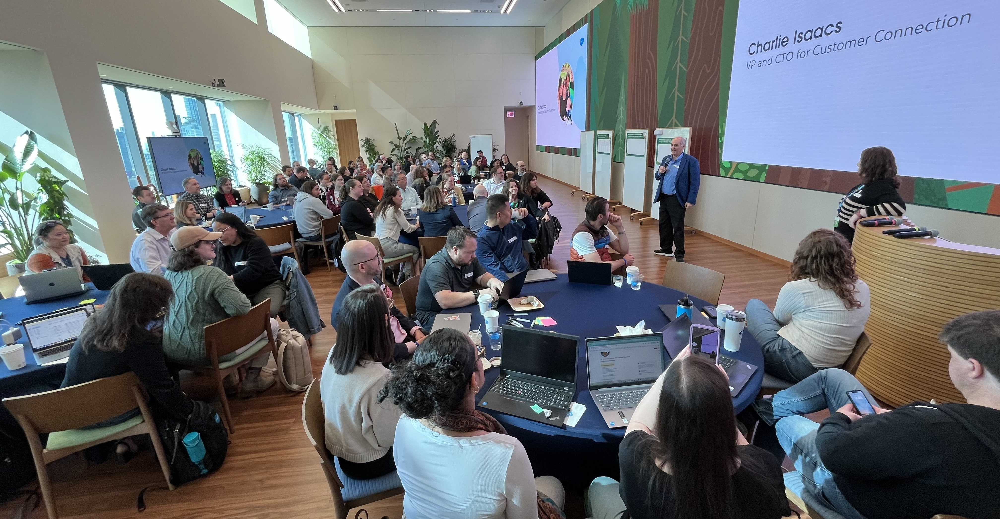
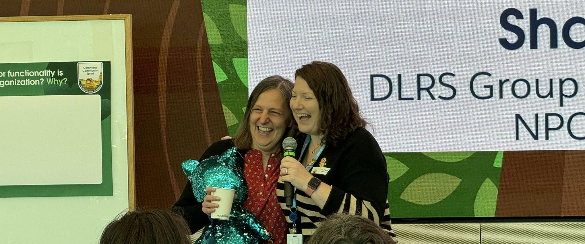
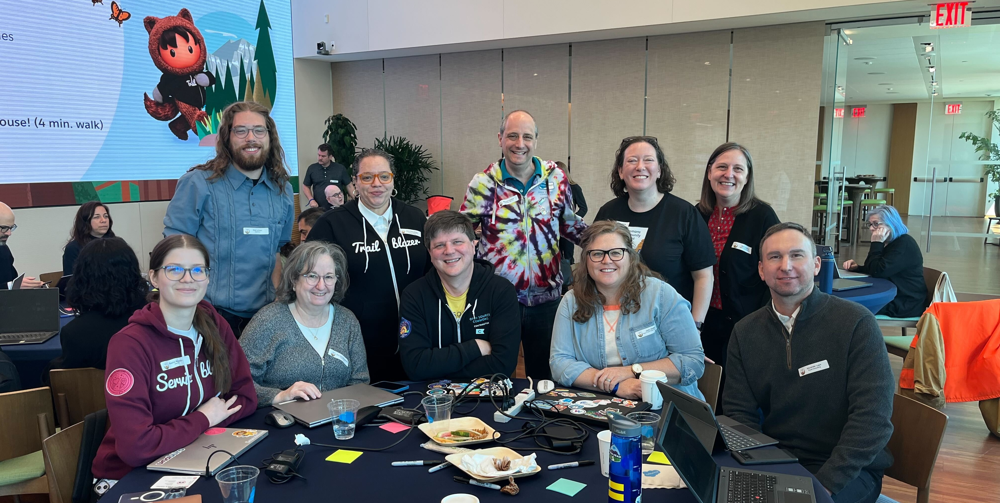

## Wrapping Up the World Tour NYC Community Sprint ##

### Dates: April 26, 2024

### Location: New York, NY

***“No matter where you are on your Salesforce career journey, participating in a sprint will enrich and move you forward.” -NYC Sprinter***

## Wrapping up the World Tour NYC Community Sprint

We were thrilled to gather in the Salesforce NYC tower for a day of brainstorming and creating impactful solutions for our Nonprofit and Education community using Salesforce.

*World Tour NYC Community Sprint team group photo, April 2024*

## Bringing together the Nonprofit & Education Community

A remarkable 76 attendees joined us in person, representing an array of folks working within the Nonprofit and Education and Salesforce ecosystems, including End Users, Administrators, Developers, Architects, etc from customer and Industry Partners from NYC and surrounding regions. 

Thank you to everyone who joined and dedicated precious time away from their daily responsibilities, your commitment to sharing your skills made this event truly exceptional. Thank you for making our collective effort such a success.

*Our Nonprofit and Education community comes together to build solutions, April 2024*

## A special welcome from Charlie Isaacs

After a fantastic networking breakfast, [Cori O’Brien](https://www.linkedin.com/in/coriobrienpaluck/) (Director, Commons Community) kicked off the Sprint, sharing her immense gratitude for the work the community is doing to support each other in the region and spend time at the Sprint. Alongside Cori, we had [Charlie Isaaces](https://www.linkedin.com/in/charlieisaacs/) (VP and CTO for Customer Connection) who extended a warm welcome to everyone, emphasising the significance of the group and the need to unite among the wider community to developing shared solutions. 

Overall, the energy in the room was buzzing and folks were eager to getting their hands on building solutions.

 

*A warm welcome from our special guest, Charlie Isaacs, April 2024*

## NEW Commons Hero: Honoring Sprint contributor Shari Carlson

What’s a Commons Hero? At this Sprint in NYC, we are introducing a new recognition - a “Commons Hero” awarded in New York to [Shari Carlson](https://www.linkedin.com/in/sharicarlson/). CONGRATS, SHARI! This is a new way we are recognizing those who consistently give back to our Commons Community. Shari has been participating in the Commons program for YEARS, was a co-leader of the original Commons project Outbound Funds, and currently leads and participates on numerous active projects. Shari is a mentor, a leader, and consistently goes above and beyond to support our community. She continues to proactively contribute to building solutions that address challenges our nonprofit community faces. YOU'RE AMAZING, SHARI! Thank you for all you do!

*New Commons Hero, Shari Carlson, is a leader and participant of various projects, including DLRS, Membership and NPC Best Practices, April 2024*

## Check out the 6 community-led projects that participated:

### 1. [Declarative Lookup Rollup Summaries (“DLRS“ aka Dolores)](https://install.salesforce.org/products/dlrs/latest)

DLRS is an interface to rollup data between records where Salesforce can’t natively.

**Work performed at this sprint:**

* Final testing of the next release of the DLRS wizard. The wizard includes a new ‘Try the Wizard’ button where you can view existing rollups, and view a modal that reminds you to deploy your trigger. This should be released in May.
* Reviewed the latest getting started documentation.
* Drafted a release post for the Trailblazer Community to share the upcoming release with the wider community.

**Next steps:** 

* Draft the release notes for the upcoming release.
* Pass the final updates to the developer to execute.

*DLRS project team photo, April, 2024*

### 2. [**Summit Events App (SEA)**](https://install.salesforce.org/products/SummitEventsApp/latest)

The Summit Events App (SEA) provides event management functionality to Nonprofits and Schools.

**Work performed at this sprint:**

* 14 people installed the Summit Events app, reviewed documentation, and provided feedback.

**Next steps:** 

* Collate feedback and improve documentation.
* Follow-up with those interested in continuing to contribute.

### 3. [Nonprofit Salesforce How-To Videos](https://www.youtube.com/@NPSFHowToSeries)

The Nonprofit Salesforce How-To Video team creates short, digestible how-to videos from Nonprofit Cloud documentation. [Connect with the team](https://trailhead.salesforce.com/trailblazer-community/groups/0F94S000000kHiqSAE?tab=discussion&sort=LAST_MODIFIED_DATE_DESC), and [watch the videos](https://www.youtube.com/@NPSFHowToSeries).

**Work performed at this sprint:**

* Drafted 5-6 new videos.
* Recorded 6 new voice-overs.

**Next steps:**

* Edit the newly drafted videos and voice-overs.

### **4. Memberships**

The Memberships team is working to build a schema for memberships, sponsorship, renewals, payments, multiple members, families, benefits, etc., within Salesforce to help Nonprofits track their data more effectively. 

**Work performed at this sprint:**

* Onboarded 10 new members of the membership community (Slack and Metecho).
* Still getting our orgs created and getting info from the last sprint, but we could generate a new org.
* Created a deck to help explain what the package is and why it does what it does.

**Next steps:**

* Complete flow functionality.
* Get to security review.

### 5. Nonprofit Cloud Best Practices

Similar to early community-led efforts to help nonprofits find success using the NPSP, the goal of this new project is to gather ideas and feedback to see what Nonprofit Cloud (NPC) best practices could look like and where the community could concentrate their efforts.

**Work performed:**

* Reviewed two use cases (one-time gift and multiple payment gift), tested the recipes hands-on in trial orgs and identified the use case template to use for posting.
* Identified gaps and possible next tasks including training, reporting, and questions about third-party integrations.

**Next steps:**

* Update the two use cases to the proposed template and publish.
* Continue meeting bi-weekly with the goal of publishing on Sprinty’s Community Resources.

### 6. Deployment Best Practices

Beginning at the [Sprint in Chicago in 2023](https://sfdo-community-sprints.github.io/docs/sprints/2023-10-3031-Sprint/#our-community-sprint-highlights), this group came together to bring the “Well-Architected” framework to action by building out documentation and step-by-step guides that are approachable to implement for Nonprofit organizations and the partners that love them

**Work performed at the sprint:**

* Onboarded 10 new members to the project.
* Reviewed the content put together in [Chicago 2023 Sprint](https://sfdo-community-sprints.github.io/docs/sprints/2023-10-3031-Sprint/#our-community-sprint-highlights) + the [Virtual Sprint](https://sfdo-community-sprints.github.io/docs/sprints/2024-02-0607-Sprint/) earlier this year.
* Reviewed documentation.
* Created a table of contents that will serve as their best practice guide.

**Next steps**

* Move the table of contents to individual Google Files and Markdown for publishing on GitHub.
* Get more contributors on board to help propel the project even further.

**PHEW! That was a lot! So much innovation taking place. But it doesn’t stop here! Register or save the date for our upcoming Sprint events:**

* **4-5 June** - World Tour London Community Sprint - [Register today](https://invite.salesforce.com/worldtourlondoncommunitysprint)!
* See all confirmed (and unconfirmed) events in the group details of the [Sprint group](https://trailhead.salesforce.com/trailblazer-community/groups/0F94S000000GwVKSA0).

See you soon!

* Commons Community Team ([Cori O’Brien](https://www.linkedin.com/in/coriobrienpaluck/), [Kristiane Kindle](https://www.linkedin.com/in/kristiane-kindle-07943a167/), & [Lizzy Roberts](https://www.linkedin.com/in/lizzyroberts/))

