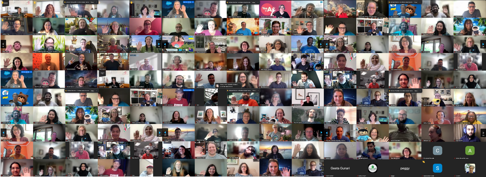
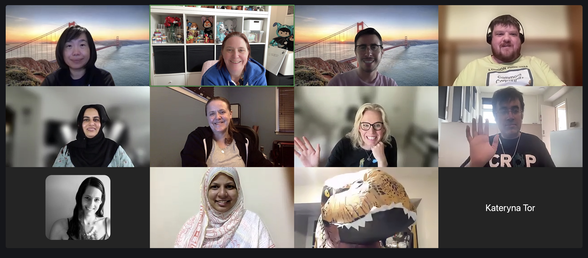
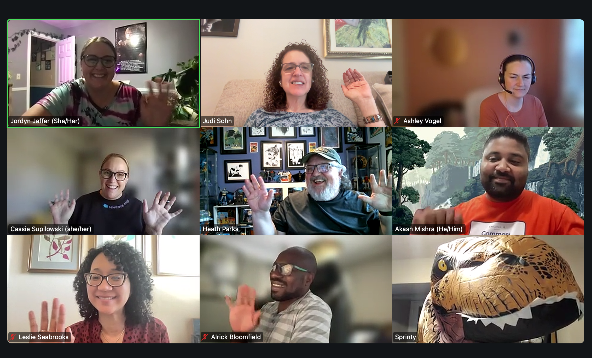
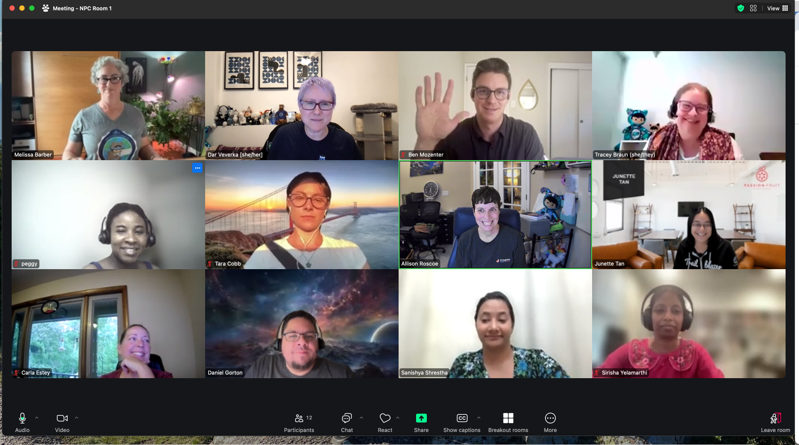

### Dates: September 26-27, 2024

### Location: Virtual, Global

***"Salesforce Open Source Community Sprints are incredible opportunities to learn, share expertise, network, build impactful solutions, and contribute to innovations for nonprofits and educational institutions! Trailblazers around our world pour a lot of heart, talent, and time into making a difference together!" - Virtual Sprinter***

## WOW, another truly global virtual sprint!

We were thrilled to gather our Nonprofit and Education community virtually for two days of brainstorming, creating impactful solutions, and fun networking to build community solutions for common challenges affecting Nonprofits and Schools. For this virtual sprint, we experimented with different start times to accommodate participants outside of the United States. We weren’t sure how this would go, but the feedback was overwhelmingly positive and appreciative of our efforts to include folks from around the world. We will likely continue experimenting in the future, but we’re glad this approach worked out!

*Full Group Picture of the Virtual Sprint attendees, Sept 2024*

## Our Global Reach: Connecting Across Continents

A remarkable 143 attendees joined us virtually, representing a diverse tapestry of Nonprofits, schools, Partners, and employees from across the globe. From Australia to Canada, to the United Kingdom, the enthusiasm and commitment were truly global, with participants hailing from 14 different countries! We extend our heartfelt gratitude to everyone who made this global collaboration possible. To those who burned the midnight oil, rose with the sun, and dedicated precious time away from their daily responsibilities and loved ones, your commitment to sharing your skills made this event truly exceptional. Thank you for making our collective effort a resounding success.

## Check out the 12 community-led projects that participated:

*In alphabetical order*

### **1. AI Prompts for Nonprofits:** **A project seeking to help Nonprofits benefit from crafting effective prompts in generative AI tools.**

This team is working to create a helpful guide of prompts to make using AI tools like ChatGPT easier for Nonprofits. 

Work performed at this sprint:

* Created an AI Prompt [recipe book](https://docs.google.com/document/d/14WPnZqcYWSof4cXYoci-fJhOLXQ8S-Cw1unMNW9sErw/edit#heading=h.35hmtg8vu8n6).
* Created best practice documentation.
* Continued to build the Wiki.

Next steps:

* To validate that the prompts created in the recipe book are valid for Nonprofit organisations.
* Continue to build out the recipe book, and Wiki. The plan is to publish the recipe book using GitHub pages in the future.
* Meet with the group soon and set up a cadence to build continued momentum for the project. Will continue work on this at the Community Sprint in Chicago in November! 

*AI Prompts Recipe Book Prompt group photo, Sept 2024*

### 2. [Declarative Lookup Rollup Summaries (DLRS)](https://install.salesforce.org/products/dlrs/latest):  User-friendly wizard to understand relationships between different sets of data in Salesforce

Declarative Lookup Rollup Summaries, aka “DLRS”, aka “Dolores” aka the app with 3 names (!) is an interface to roll up data between records where Salesforce can’t natively. 

Work performed at the Sprint:

* Documentation: completed the FAQ and prepped it for posting. Created a list of Nonprofit Cloud rollups to submit as recipes. Brainstormed ideas for the Optimizer.
* Development: finalized the QA org (big step that been in process for several sprints). The team is now ready to set up robot testing.

Next Steps:

* Post FAQ documentation.
* Write robot tests.

[Learn more about this project!](https://install.salesforce.org/products/dlrs/latest)

Join the [_Commons Project: DLRS_](https://trailhead.salesforce.com/trailblazer-community/groups/0F9300000009O5pCAE) group in the Trailblazer Community to ask questions or get involved.

### 3. Deployment Best Practices: Defining practice best practices to share with the community at large

The goal of this project is to bring the “Well-Architected” framework to action by building out documentation and step-by-step guides that are approachable to implement for nonprofit organizations and the partners that love them. 

Work performed at the Sprint:

* Created 5 guide documents from the perspective of a solo admin.
* Prepped the testing guide and the environment guide that will be published to GitHub soon. 

Next Steps:

* Move the documents that are ready for GitHub to GitHub and set up a time to finish the 3 other docs by the next Sprint.

[Learn more about this project!](https://github.com/SFDO-Community-Sprints/deployment-best-practices)

*Team Deployment Best Practices group photo, Sept 2024*

### 4. NEW: Education  Cloud Trailblazers

Similar to the Nonprofit Cloud Best Practices group, the goal of this project is to begin gathering ideas and feedback to see what the Education Cloud best practices could look like and where the community could concentrate their efforts.

Work performed at the Sprint:

* Created a [V2MOM](https://docs.google.com/spreadsheets/d/1eGFBFotG81qOcEMhTErO5PY2XaYBLJALq9kYTrZovso/edit?gid=0#gid=0).
* Created common use cases.
* Create a [structure to document resources](https://docs.google.com/spreadsheets/d/1eGFBFotG81qOcEMhTErO5PY2XaYBLJALq9kYTrZovso/edit?gid=0#gid=0) that will support schools to consider the use of or transition to Education Cloud and centralize knowledge.

Next steps:

* Finding a mechanism to promote and share this information Recruit others to the project.
* We will complete the foundational "Education Cloud Resource" tab and attempt to complete the "common capabilities" list on the Use Cases tab.

### 5. Membership Essentials: App to help Nonprofits track their membership data more effectively

The Membership Essentials team is prepping to launch their upcoming package to deliver features helpful for memberships, sponsorship, renewals, payments, multiple members, families, benefits, etc., within Salesforce to help Nonprofits track their data more effectively.

Work performed at the Sprint:

* Documentation: The GitHub pages were fixed and the new logo was added. Getting Started section finalized, including install, post install, and install considerations.
* Development: Check-in 4 new commits, and fixed bugs, including the duplicate account creation bug.

Next Steps:

* Continue to work on Flows, Documentation and Overview Deck

[Learn more about this project!](https://github.com/SFDO-Community-Sprints/MembershipSchemaAndBenefits#membership-schema-and-benefits)

Join the [_Commons Project: Memberships_](https://trailhead.salesforce.com/trailblazer-community/groups/0F94S000000kHjYSAU) group in the Trailblazer Community to ask questions or get involved.

### 6. Nonprofit Cloud Best Practices

Similar to early community-led efforts to help nonprofits find success using the NPSP, the goal of this project is to begin gathering ideas and feedback to see what the Nonprofit Cloud (NPC) best practices could look like and where the community could concentrate their efforts.

Work performed at the Sprint:

* We split into two groups, one focused on developing ARC Relationships and the other worked on Flows.
* The ARC group developed ARC Use Cases and data import templates for Party Role Relationships.
* The Flow group added Element definitions and Flow summaries for several Flows that will be added to an unmanaged package, available for download before the upcoming Chicago Sprint.
* Updated Fundraising Use Cases, NPSP to NPC Translation charts, and GitHub pages.

Next Steps:

* Launching the unmanaged package and adding the last Fundraising use cases.
* Publish articles
* We'll be shifting our focus to Program and Case Management at the upcoming Community Sprint in Chicago in November - happy to have people join us then!

[Learn more about this project:](https://github.com/SFDO-Community-Sprints/npc-best-practices)

*The Nonprofit Cloud Best Practices group photo, Sept 2024*

### 7. NEW:  NPSP Data Kit for Data Cloud

This new group is building Data Cloud functionality, including a DataKit for the NPSP, including different use cases to enable the NPSP user to explore using Data Cloud.

Work performed at the Sprint:

* Developed the Data Kits with all the Data Cloud Objects (Data Streams, DLO's, DMO's, Identity Resolution, Calculated Insights).
* Came up with the solution design for the Data Kits and create the help document for the End Users of NPSP and also the documentation of the Readme and Git repository version control.

Next Steps:

* Arrive at a simple Use for the Data Kit creation: Accounts & Contacts.
* Complete the solution design for the Data Kits and complete/publish.

### 8. [Salesforce Indicators](https://install.salesforce.org/products/indicators/latest): Open source Lightning Web Component to highlight key indicators on a Salesforce record

A new LWC that allows you to highlight important data in Salesforce with icons and colors, making it easy to focus on what matters most on a record page. This newly launched product participated at their first in-person Sprint this fall and worked on building out a cookbook of recipes for users, and worked on new features from the backlog. They’re looking for new volunteers to join the team if you have a few hours to spare each month!

Work performed at the Sprint:

* Worked out our key documentation page.
* Created a mock-up of a Welcome page (still deciding if we will build it though), lots of discussions more work on our new UI.

Next Steps:

* More documentation.
* UI Development.

[Learn more about this project!](https://install.salesforce.org/products/indicators/latest)

Join the [_Commons Project: Salesforce Indicators_](https://trailhead.salesforce.com/trailblazer-community/groups/0F94S000000HEDASA4) group in the Trailblazer Community to ask questions or get involved.

### 9. [Sprinty’s Community Resources](https://sprintyscommunityresources.my.site.com/s/): Curated community content to help nonprofits find what they need, fast!

Sprinty’s Community Resources (SCR) is a curated site for the nonprofit and education community where people can share resources that have been helpful to them and benefit from the experience of others. SCR includes hundreds of blog posts, Trailblazer Community conversations, online videos, and much, much more. 

Work performed at the Sprint:

* Audited resources for a two-day total of 170!!
* Volunteers searched for a resource of their choice, completed a usability survey to give us feedback on their experience, and brainstormed ways we could improve the site. Including a slogan/tagline to consider in our marketing efforts, "curated by humans."

Next Steps:

* We will share all the recommendations and ideas for improvement with the Sprinty’s Community Resources team to continue building a great library of community resources!

[Learn more about this project!](https://sprintyscommunityresources.my.site.com/s/)

Join [Sprinty’s Community Resources](https://trailhead.salesforce.com/trailblazer-community/groups/0F94S000000kQ1NSAU) group in the Trailblazer Community to ask questions or get involved.

### 10. Sticky Selectron Lightning Web Component (LWC): Datatable Lightning Component for working with multiple records in a screen flow

This team has built a new high-performing data table with a 2K row limit for working with multiple records in a screen flow that allows for easy selection of multiple records in a screen flow that will persist (or remain “sticky”) upon return to the record selection screen for any further modifications. 

Work performed at the Sprint:

* Modified Sticky Selectron Canvas, validated and improved documentation, continued testing in DE, tested dummy data files with 3K records, tested product support for different field types, and updated list of features/issues.

Next Steps:

* Finalize testing, documentation, and videos for our minimum viable product (MVP)
* Get added to the AppExchange, hopefully in the next few months!

[Learn more about this project!](https://github.com/SFDO-Community-Sprints/SSSFDG)

Join the [_Commons Project: Sticky Selectron_](https://trailhead.salesforce.com/trailblazer-community/groups/0F94S000000HDS7SAO) group in the Trailblazer Community to ask questions or get involved.

### 11. [**Summit Events App**](https://install.salesforce.org/products/SummitEventsApp/latest) (SEA): Community-built event management solution for Nonprofits and Schools

Summit Events App is an end-to-end event management solution for everyone. SEA provides customizable event management, making registration, receipting, confirmation, and reporting easier and integrated with Salesforce. 

Work performed at the Sprint:

* Created a quick event set-up screen flow and a check-in screen flow.
* Worked on documentation, Person Account flow, coding person accounts, created new reCAPTCH feature documentation, and created a help page for the app.

Next Steps:

* Continue meeting regularly to maintain progress.

[Learn more about this project!](https://install.salesforce.org/products/SummitEventsApp/latest)

Join the [_Commons Project: Summit Events App_](https://trailhead.salesforce.com/trailblazer-community/groups/0F94S000000kHi2SAE) group in the Trailblazer Community to ask questions or get involved.

### 12. Unsubscribe Link

Send an email to anyone from inside Salesforce and include an unsubscribe link right in the email! This app will find all contacts and leads with that email address and mark them “Email opt out.” It will also create an Unsubscribe (custom object) object so you can track unsubscribes over time.

Work performed at the Sprint:

* Group 1 (testing):
    * Edited and made suggestions on the installation instructions. 
    * Got a good start through the Testing Scenarios that had been prepared for us before the Sprint. 
    * Opened up a couple of issues that were not related to the testing scenarios.
* Group 2 (flows):
    * Restricted selections so that only noreply display only Default No Reply and User Selection and Default No reply Addresses when selecting org-wide email addresses.
    * Renamed flows with new naming convention, with future pull request.
* Group 3 (dev ops and apex):
    * Complete draft for Wiki
    * New Utility class, batch class, two invocable classes and test classes to cover all existing use cases for generating Public_Id__c field values.

Next steps:

* Pull requests for all of the above and integration into main github branch.

[Learn more about this project!](https://github.com/SFDO-Community/UnsubscribeLink)

## Don’t miss our upcoming events! Join the [Commons & Sprint](https://trailhead.salesforce.com/trailblazer-community/groups/0F94S000000GwVKSA0) group in the Trailblazer Community and be the first to hear about where we’ll be Sprinting next.

