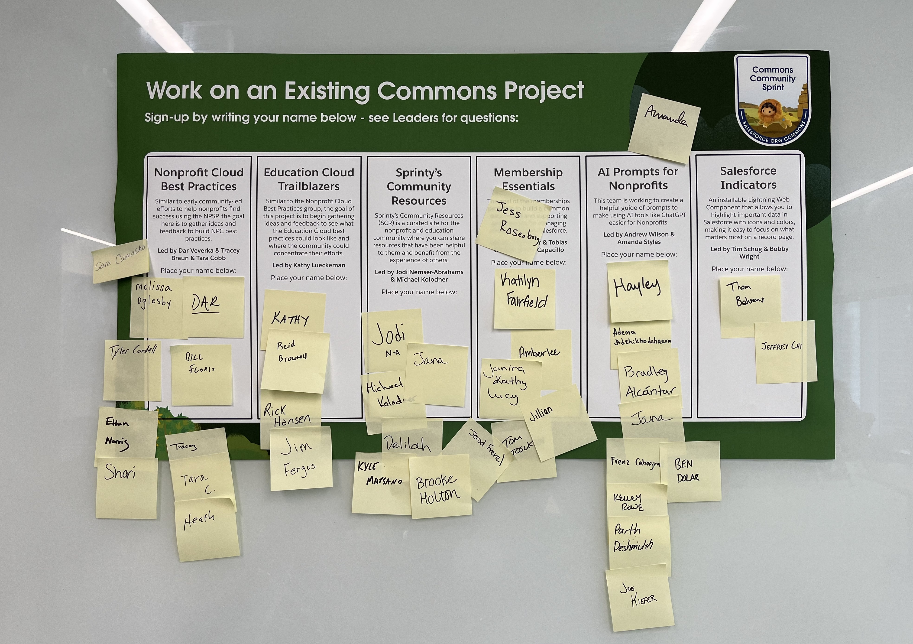
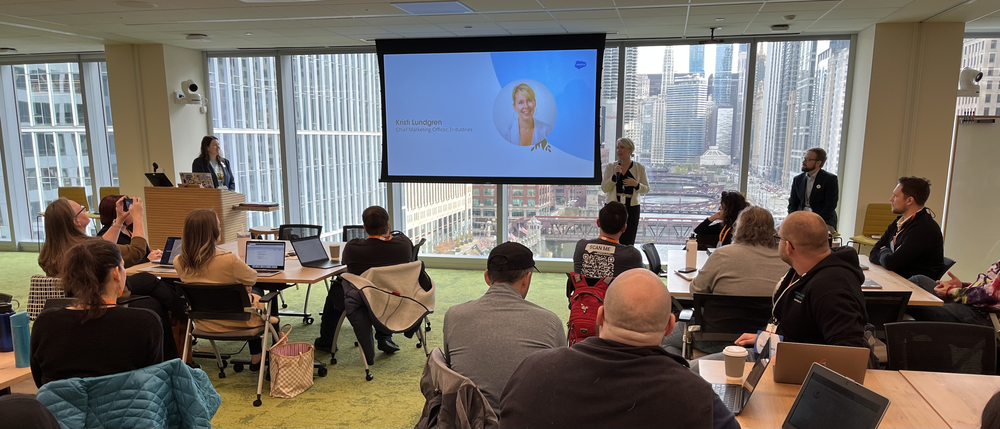
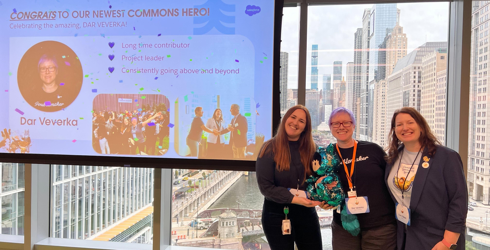
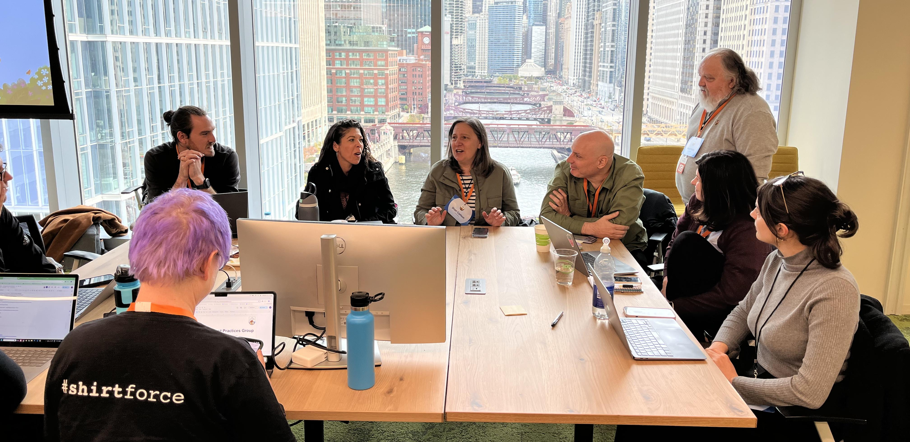
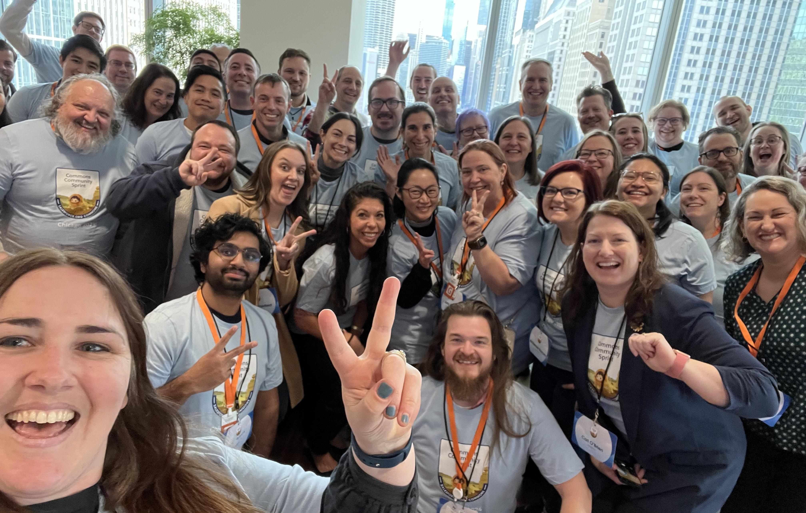

### Dates: November 13-14, 2024

### Location: Chicago, Illinois

## Wrapping Up the Commons Community Sprint in Chicago! 

We were thrilled to gather in Chicago for two days of brainstorming and creating impactful solutions for our Nonprofit and Education community using Salesforce.

*Group photo of the Commons Community Sprint, November 2024*

## Bringing together the Nonprofit & Education Community

We were thrilled to host the last Sprint of 2024 in Chicago, connecting in-person for two days of brainstorming and creating impactful solutions for our Nonprofit and Education community using Salesforce.

A remarkable 60 attendees joined us, representing an array of Customer and Industry Partners working within the Nonprofit and Education and Salesforce ecosystems, including End Users, Administrators, Developers, and Architects from from the Chicago area, and from across North America representing 24 different states (!) and 5 Canadian provinces. Wow!

Thank you to everyone who joined and dedicated precious time away from their daily responsibilities, your commitment to sharing your skills made this event truly exceptional. Thank you for making our collective effort such a success. And, a big thank you to Thaddaeus Dahlberg who joined virtually to help train the Membership Essentials, NPC Best Practices, and Nonprofit AI Commons teams on how to publish resources on Github Pages!

*Projects in action - see what’s being worked on at the Sprint in Chicago, November 2024*

## A Special Welcome from Salesforce Leadership

After a fantastic networking breakfast, [**Cori O’Brien**](https://www.linkedin.com/in/coriobrienpaluck/) (Director, Commons Community) kicked off the Sprint, sharing her immense gratitude for the work the community is doing to support each other in the region and spend time at the Sprint. Alongside Cori, we had **[Stephen Brokaw](https://www.linkedin.com/in/stephen-brokaw-5a82741/)** (Chief of Staff, Salesforce for Nonprofits) and **[Kristi Lundgren](https://www.linkedin.com/in/kristi-lundgren/)** (CMO, Industries Marketing) extend a warm welcome to everyone, emphasizing the importance and value of this community and the need to unite our Nonprofits and Schools in developing shared solutions. 

*A warm welcome from our special guests, Kristi Lundgren and Stephen Brokaw, November 2024.*

## Announcing the newest Commons Hero, Dar Veverka! 

CONGRATS to our newest Commons Hero, [Dar Veverka](https://www.linkedin.com/in/darveverka/)! This is our way of recognizing those who consistently give back to our Nonprofit Commons Community. YOU'RE AMAZING! Read the [full article on LinkedIn](https://www.linkedin.com/pulse/celebrating-dar-veverka-true-commons-hero-lizzy-roberts-qkamc) to learn more about Dar's contributions to the Community.

*Our newest Commons Hero, Dar Veverka, November 2024.*

Overall, the energy in the room was buzzing and folks were eager to get started identifying challenges and getting their hands on building solutions. Let’s get into what was worked on during the next two days...

## Check out the 6 community-led projects that participated:

*In alphabetical order*

### 1. AI  Prompts for Nonprofits

AI Prompts is a helpful guide to make using AI tools easier for Nonprofits to adopt and consume.

Work performed at this sprint:

* Proof of Concept about how AI tooling could be used to support the rest of the Commons, and developed a plan for posting the existing materials.
* Identified our next steps as defining a framework for how we plan to curate and maintain materials.
* Discussed how Agentforce could be incorporated into this project or future AI projects.

Next steps:

* Continue Meeting to Define our Materials Framework.

*The AI Prompts for Nonprofits group in action during the Sprint, November 2024*

### 2. Education Cloud Trailblazers

Similar to the Nonprofit Cloud Best Practices group, the goal of this project is to begin gathering ideas and feedback to see what the Education Cloud best practices could look like and where the community could concentrate their efforts.

Work performed at this sprint:

* Object Relationships and Data Integration: Discussed how Education Cloud integrates standard Salesforce objects, custom objects, and objects from other industries to create a comprehensive student 360° experience, avoiding complex data models.
* Focus Areas: Student Success & Recruitment: Highlighted Winter release features aimed at improving student tracking and simplifying the admissions process, leading to smoother workflows and better data views.
* The Automation Headache: Addressed the lack of built-in automation in Education Cloud compared to EDA, noting the challenges in automating complex contact relationships and account-to-account relationships.
* Hands-On with EDA GitHub: Explored Salesforce Foundation EDA GitHub, tackling issues like duplicate faculty affiliations, public groups setup, knowledge articles, and sharing rules, while optimizing fields to reduce repetitive data entry.
* Custom Solutions (Flows, Apex, Invocable Actions): Experimented with pre-save flows, Apex triggers, and invocable actions to simulate EDA functionality in Education Cloud, aiming for a more tailored approach without relying on a one-size-fits-all solution.

Next steps:

* Continue the discussion on how to close the gaps between what Education Cloud delivers and what we need day-to-day. EDA gave some great starting points, but making Education Cloud fit specific use cases still means rolling up your sleeves and building custom solutions.

### 3. Salesforce Indicators

Indicators is a custom metadata-driven Lightning Web Component that allows you to highlight important data in with icons and colours, making it easy to focus on what matters most on a Salesforce record.

Work performed at this sprint:

* Enhancements and improvements to the interface for creating an indicator bundle and indicator item.
* Created an Apex utility for date comparisons for Indicator Extensions and started adding it to the LWC to support use of Relative Dates.
* Continued securing the merged code to play nice together to create custom metadata.
* Attempted to provide a fix to address reported deployment issues.
* Drafted Release Notes for upcoming release.

Next steps:

* Continue to refactor code and work towards release.

### 4. Membership Essentials

The Membership Essentials project is an App to help Nonprofits track their membership data more effectively.

Work performed at this sprint:

* Created test scripts and package testing
* Three commits merged
* Created a log object to log testing
* Updated test documentation
* Added "last modified by" stamp to io.pages

Next steps:

* Continue testing and debugging.

### 5. Nonprofit Cloud Best Practices

Similar to early community-led efforts to help nonprofits find success using the Nonprofit Success Pack (NPSP), the goal of this project is to begin gathering ideas and feedback to see what the Nonprofit Cloud (NPC) best practices could look like and where the community could concentrate their efforts.

Work performed at this sprint:

* Drafted NPSP to NPC comparison chart for Program Management Objects
* Started list of tasks for Program Management Working Subgroup
* Got images on GitHub
* Added more pages to GitHub
* Started a Reports Working Subgroup and started review Report Types to package
* Added some basic Reports and Report Types for Relationships to package
* Had a deep dive with Salesforce leadership on areas of mutual benefit for customers and SIs

Next steps:

* Add more content to GitHub with the goal of launching by the end of the year.

*Nonprofit Cloud Best Practices group in action during the Sprint, November 2024*

### 6. [Sprinty’s Community Resources](https://sprintyscommunityresources.my.site.com/s/)

Sprinty’s Community Resources (SCR) is a curated site for the nonprofit and education community where people can share resources that have been helpful to them and benefit from the experience of others. SCR includes hundreds of blog posts, Trailblazer Community conversations, online videos, and much, much more.

Work performed at this sprint:

* Deep discussions about what is our goal for next steps in increasing engagement with Sprinty's Community Resources.
* Trying to determine how to get more people to think of the site for looking to answer questions, how to get more new admins to know about the site, etc.
* Created an MVP for upvotes, downvotes to justify engagement and validity of the resources added to SRC.

Next steps:

* Work on an MVP to continue the project in the next few months.
* More discussion!

Thanks for an amazing week, Chicago! 

*Group selfie from the Chicago Community Sprint, November 2024*

This was our last in person Sprint of the year, get ready for a busy 2025 to come AND the 10-year anniversary of the Commons Program *(we’ll be celebrating the whole year get ready!)*

## Don’t miss our upcoming events! Join the [Commons & Sprint](https://trailhead.salesforce.com/trailblazer-community/groups/0F94S000000GwVKSA0) group in the Trailblazer Community and be the first to hear about where we’ll be Sprinting next.

