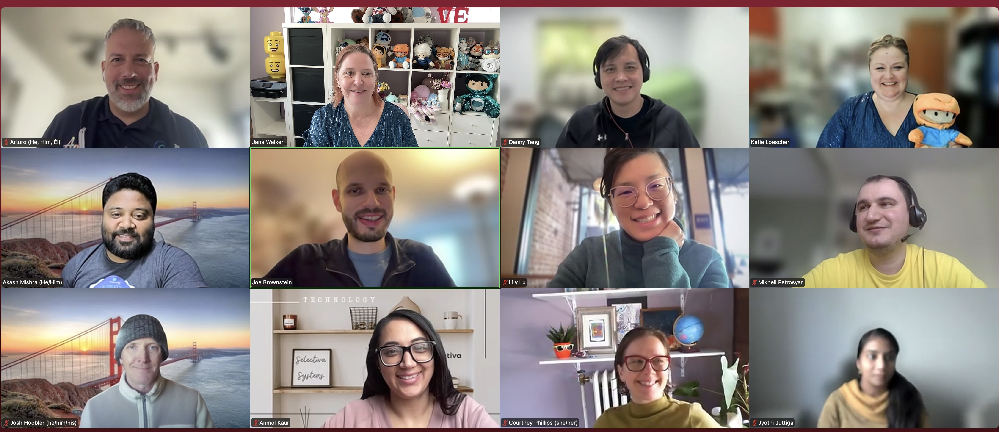
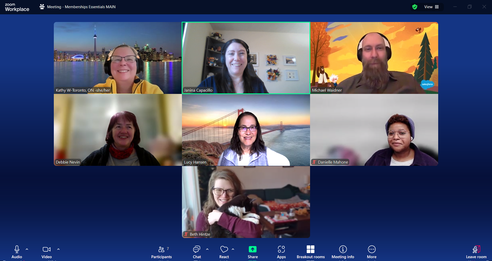
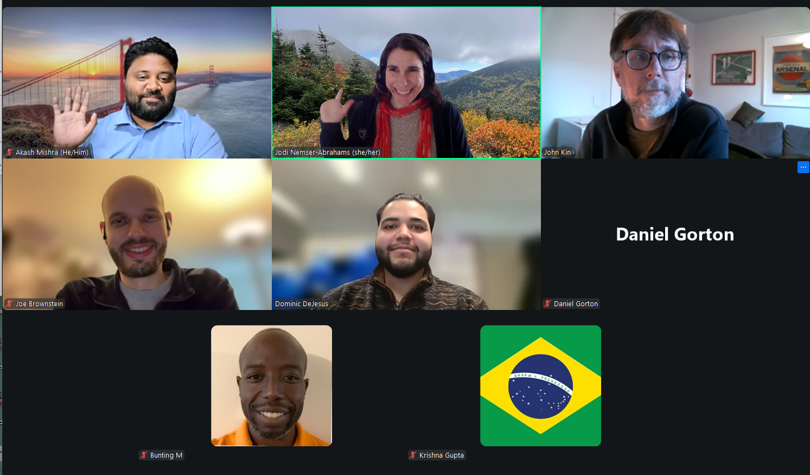
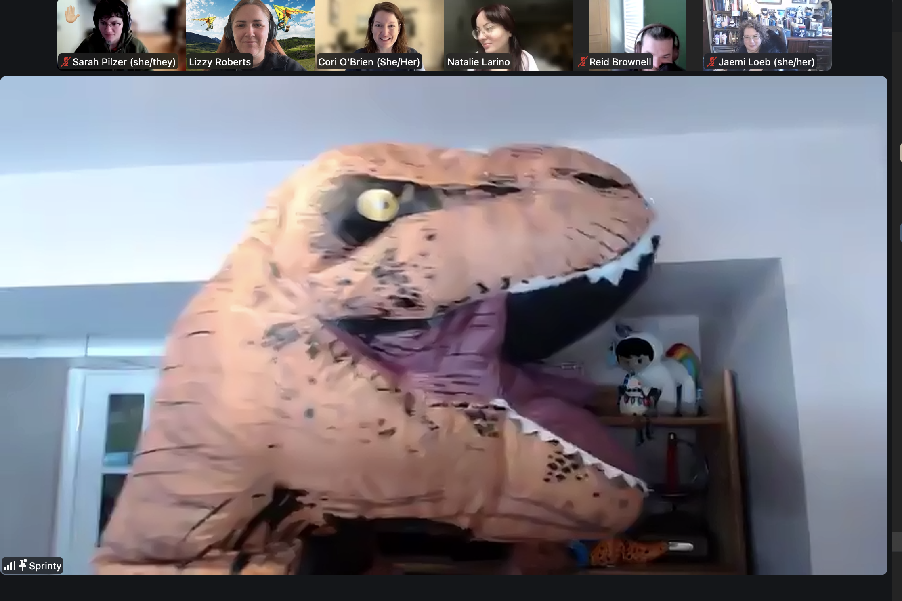

### Dates: January 21-22, 2026

### Location: Virtual via Zoom

_I really loved the Nonprofit Sprint - it was my first time, and everyone was incredibly welcoming and supportive. I learned about many new and inspiring tools, and what stood out most was the strong sense of collaboration, with people truly helping each other and sharing knowledge. It was a great community experience!_ - Virtual Sprinter

# WOW, another truly global virtual Sprint!
We were thrilled to gather our Nonprofit and Education community virtually for two days of brainstorming, creating impactful solutions, and fun networking to build community solutions for common challenges affecting Nonprofits and Schools.

_Group Photo! Virtual Sprint, Jan 2026_

## Our Global Reach: Connecting Across Continents
A remarkable 154 attendees joined us virtually, representing a diverse group of Nonprofits, schools, Partners, and employees from across the globe. From Australia to Canada, to Germany and the United Arab Emirates, the enthusiasm and commitment were truly global, with participants hailing from 19 different countries!

We extend our heartfelt gratitude to everyone who made this global collaboration possible. To those who burned the midnight oil, rose with the sun, and dedicated precious time away from their daily responsibilities and loved ones, your commitment to sharing your skills made this event truly exceptional. Thank you for making our collective effort a resounding success.

## Nonprofit Roadmap Q&A

Thank you to Lori Freeman, Kelli Hudson, and the Nonprofit Product Team who joined us at the start of the Virtual Sprint to share about your team, your focus for the year, the upcoming product roadmap, and answered questions during our Q&A! Our community always asks for updates about what's coming with the product, so it was great to get these updates from your team right before everyone dove into projects, helping to level set on what Salesforce's plan is for the year.

## Let’s Sprint!

After morning introductions and the Nonprofit Roadmap Q&A, it was time to get to work. 

## Check out the 12 community-led projects that participated:

_In alphabetical order_

* Agentforce Nonprofit Best Practices (3 subgroups)
* AI for Nonprofits (2 subgroups)
* Declarative Lookup Rollup Summaries (DLRS)
* Education Cloud Trailblazers
* Membership Essentials
* Nonprofit Bridge
* Nonprofit How-To Videos
* NPSP Workflow Replacements
* Salesforce Indicators
* Sprinty’s Community Resources
* Summit Events App
* Unsubscribe Link

## 1. Agentforce Nonprofit Best Practices (AFNBP)*

_Recently renamed their group from Nonprofit Cloud Best Practices to the Agentforce Nonprofit Best Practices group to align with the recent changes to the Nonprofit Cloud product name._

Similar to early community-led efforts to help nonprofits find success using the NPSP, the goal of this project is to begin gathering ideas and feedback to see what the Agentforce Nonprofit Best Practices could look like and where the community could concentrate their efforts. There were 3 sub-groups for this project: Reporting, Grantmaking and DocGen.

Work performed at the Sprint:
* Reporting: Selected Program Reports as their next reporting project, began compiling a comprehensive list of needed reports for nonprofits using AFNP, completed review and draft notes for NPSP Program Management Module report list, and planned out workflow for next group meetings.
* Grantmaking: Started mapping PowerPoint slides for AFNP grantmaking, created an outline for populating those slides with key grantmaking considerations, published the Grantmaking Considerations page, and started on a slide deck to help map programs and funding opportunities.
* DocGen: Defined the project scope, established their jobs to be done, completed several initial tasks, compiled a DocGen Data Dictionary for the objects needed for the DAF Acknowledgement, and worked on getting the DAF Acknowledgement Letter working in a scratch org including the data mapper.

Next Steps:
* Reporting: The Program and Case Management subgroup will continue its hiatus to focus on getting these reports out; the reporting group will then move on to Grantmaking and the PCM group will resume its work with Case Management use cases.
* Grantmaking: Complete the mapping slide deck to help outline functionality orgs need for funding opportunities to help translate to AFNBP functionalities; bi-weekly meetings to continue the work.
* DocGen: Finalize and document the process along with prerequisites for setup.

Learn more about this project.

## 2. AI for Nonprofits: A project seeking to help Nonprofits benefit from generative AI tools and Agenforce.
This team is working to create a helpful guide of prompts to make using AI tools like ChatGPT and Agentforce easier for Nonprofits.

Work performed at this sprint:
The team split into two subgroups to tackle different AI use cases for nonprofits.
* Donor Snapshot Group: Set up a sandbox environment, connected it to Slack, designed the output structure for a Donor Snapshot Record to help nonprofits quickly understand donor relationships, and began building out the Sprinty Super Snapshot agent (encountered some blockers during testing on the first topic).
* Case Triage & Response Drafting Agent Group: Identified the challenge of nonprofits receiving high volumes of cases (assistance requests, volunteer questions, event inquiries), explored solutions using flows to trigger agents, created a planning document and defined specific objectives, spun up a dev org, and built a draft agent to classify cases based on Subject and Description using ChatGPT-generated prompts with a flex action (this version provides recommendations for support reps to review rather than automatically assigning case types).

Next steps:
* Donor Snapshot Group: Continue testing and building the agent, create additional topics, complete Salesforce-side testing, then test in Slack.
* Case Triage & Response Drafting Agent Group: Finalize agent functionality, migrate to the AI Nonprofits org, document build steps with modification instructions for organization-specific Case Types, and expand design to include Case Subtypes and draft responses.
* Continue working through blockers related to AI functionality in Slack and NPC licenses.

Join the Commons Project: AI for Nonprofits group in the Trailblazer Community to ask questions or get involved.

_AI for Nonprofits Group Photo! Virtual Sprint, Jan 2026_

## 3. Declarative Lookup Rollup Summaries (DLRS): User-friendly wizard to understand relationships between different sets of data in Salesforce

Declarative Lookup Rollup Summaries, aka “DLRS”, aka “Dolores” aka the app with 3 names (!) is an interface to roll up data between records where Salesforce can’t natively.

Work performed at this sprint:
* Created comprehensive documentation for how to call DLRS from a Flow.
* Developed documentation for what to do when you inherit an existing DLRS implementation.
* Updated Getting Started documentation to improve onboarding for new users.
* Started working on SOQL/relationship criteria documentation.
* Brainstormed future feature needs and approaches for the roadmap.

Next Steps:
* Post the new documentation on the site.

Join the Commons Project: DLRS group in the Trailblazer Community to ask questions or get involved. Learn more about this project!

## 4. Education Cloud Trailblazers
Similar to the Agentforce Nonprofit Best Practices group, the goal of this project is to begin gathering ideas and feedback to see what the Education Cloud best practices could look like and where the community could concentrate their efforts.

Work performed at the Sprint:
* Guided Relationship Screen Flow: Tested the screen flow in an org, updated page layouts and Lightning Record Pages, created a new ARC Graph, captured screenshots for documentation, drafted an ERD, updated the flow, and drafted comprehensive instructions.
* LMS Integration Playbook: Created a new sprint document, formatted content, defined acronyms for clarity, streamlined data order to better convey intent and use, and finalized all edits to the playbook.

Next steps:
* Add both the Guided Relationship Creation flow/documentation and the LMS Integration Playbook to the GIT repository.

## 5. Membership Essentials: App to help Nonprofits track their membership data more effectively
The Membership Essentials team is prepping to launch their upcoming package to deliver features helpful for memberships, sponsorship, renewals, payments, multiple members, families, benefits, etc., within Salesforce to help Nonprofits track their data more effectively.

Work performed at the Sprint:
* Onboarded team members to Metecho for collaborative development and troubleshot and deployed fixes for flows, including amending existing flows with several new pieces.
* Consolidated all use cases into one comprehensive document, continued flow documentation to support user understanding and implementation, and finished updating and documenting field descriptions and help text.
* Defined, built, and deployed duplicate contact and account automation to the package.
* Started and continued documenting reports that are part of the package, identified additional items that need to be documented and existing automation that may need revisiting to account for additional use cases, and identified initial tasks to be completed for security review.

Next Steps:
* Continue working on all open items including flow troubleshooting, documentation, and security review preparation.

Join the Commons Project: Memberships group in the Trailblazer Community to ask questions or get involved. Learn more about this project!

_Membership Essentials Group Photo, Jan Sprint, 2026_

## 6. Nonprofit Bridge
Nonprofit Bridge is a brand new project that was started at the Denver Community Sprint in November 2025. The project was founded to create a future-proofed entry point for nonprofits to the Salesforce platform, where every organization can choose the level of complexity that meets their needs. The team aims to design a modular suite of features that can extend the core platform to support common nonprofit CRM needs.

Work performed at the Sprint:
* Held constructive discussions regarding the purpose and mission of Nonprofit Bridge and initiated partnership with the Salesforce product team.
* Determined breakout rooms for continued direction including feedback for NPSP/AFNP, edge case scenarios for nonprofits, generating problem statements, customer narratives, roadmap and scaling to AFNP, and received roadmap overview.
* Conducted deep dives into the challenges that nonprofits face when deciding how and when to move forward with Salesforce and the approaches to doing so, discussed potential edge cases and how to serve audiences with unique use cases.
* Worked on defining the different levels of pillars and what they would mean regarding criteria, filled out a table to align needs with features, and listed features that align with needs.

Next steps:
* Complete and revise the table comparing pillar levels and criteria.
* Continue discussions of potential outputs for serving smaller nonprofits.
* Explore development resources on resolving common nonprofit tech issues on the Salesforce platform.
* Connect with AFNBP (Agentforce Nonprofit Best Practices) group to explore collaboration opportunities.

## 7. Nonprofit Salesforce How-To Videos
The Nonprofit Salesforce How-To Video team creates short, digestible how-to videos from Agentforce Nonprofit (formerly Nonprofit Cloud) documentation.

Work performed at the Sprint:
* Tested four different AI models to evaluate an existing script and assess AI's effectiveness in supporting script creation.
* Conducted experimentation with creating scripts from scratch using various AI models to identify best practices (Claude emerged as the clear winner!).
* Created a comprehensive survey to gather feedback from nonprofit admins and users about what how-to videos they would most benefit from, including expanding coverage beyond NPSP to other Open Source Commons Projects (like DLRS) and UnofficialSF Components.
* Took detailed notes from the LLM testing to prepare for updating project documentation.

Next steps:
* Finalize and distribute the survey to nonprofit users to gather input on video priorities (Take the 5-minute survey here! And share with your teammates!).
* Edit and update the project wiki with 2026 guidelines for using AI in script writing, incorporating findings from the sprint.
* Use survey results to inform future video production priorities.

Connect with the team, and watch the videos.

## 8. Nonprofit Success Pack (NPSP) Workflows Replacement with Flow
The NPSP Workflows Replacement with Flow group creates Flows to consolidate and replace Workflow Rules for NPSP and Volunteers for Salesforce (V4S) packages.

Work performed at the Sprint:
* Broke into flow groups and tested and worked on numerous flows.
* Connected to GitHub and started moving XML files into the repository.
* Got a version of every flow saved and tested.
* Completed a significant amount of documentation.
* Updated GitHub with project files.
* Created a draft documentation site (https://sfdo-community-sprints.github.io/npsp-workflow-replacements/).

Next Steps:
* Continue working on documentation and GitHub files.
* Two volunteers are excited to work on creating installable packages (one for NPSP and one for V4S) pending permission.

## 9. Salesforce Indicators
With Salesforce Indicators, you can visually highlight important data at a glance, making it easy to focus on what matters most. This Custom Metadata driven Lightning Web Component is all about making key details pop, and giving you lightning-quick insights at a glance on your Salesforce records.

Work performed at the Sprint:
* Onboarded all team members to Metecho (the team's first time using it for sprints and it worked fantastically!) and started testing code that has been in development over the past few months.
* Found two excellent bugs during testing and made progress on other new features.
* Had in-depth content and discussion about new features and prepared screenshots for documentation related to SLDS2 issues.
* Created documentation on the differences between SLDS1 and SLDS2.

Next Steps:
* Continue testing and discussing new features under consideration.
* Work toward a beta release for the new features.

## 10. Sprinty’s Community Resources: Curated community content to help nonprofits find what they need, fast!
Sprinty’s Community Resources (SCR) is a curated site for the nonprofit and education community where people can share resources that have been helpful to them and benefit from the experience of others. SCR includes hundreds of blog posts, Trailblazer Community conversations, online videos, and much, much more.

Work performed at the Sprint:
* The 10-person team explored how to make topics more useful and intuitive for site visitors by analyzing specific topic examples and discussing what information would be most helpful.
* Tested and evaluated what components are needed for a topic to effectively guide users who come to the site seeking to learn.
* Identified key elements that enhance topic organization and user experience.

Next Steps:
* Implement a flexible topic structure that supports both broad and granular categorization with subtopic grouping.
* Develop guiding questions for each topic to help contributors understand what resources to submit and help learners know what to explore.
* Create topic-specific content (potentially as future sprint projects) to enhance the user experience.

Join Sprinty’s Community Resources group in the Trailblazer Community to ask questions or get involved. Learn more about this project!

_Sprinty’s Community Resources group photo, Jan Virtual Sprint 2026_

## 11. Summit Events App (SEA): Community-built event management solution for Nonprofits and Schools
Summit Events App is an end-to-end event management solution for everyone. SEA provides customizable event management, making registration, receipts, confirmation, and reporting easier and integrated with Salesforce.

Work performed at the Sprint:
* Provided an overview of SEA for team members, supported installation setup, reviewed and prioritized backlog items, and identified enhancement requests from the community.
* Demoed QR Code reader functionality, drafted a lightning registrant page, and worked on Stripe payment integration.
* Discussed enhancements including flows to make event setup easier, cleaned up SEA Help Text, and outlined video needs for documentation.
* Conducted appointment type rules feature ideation and discussed documentation rework to embed more useful help for end users.

Next Steps:
* Continue work on Help Text improvements.
* Work on creating videos for documentation.
* Invited team members to SEA Slack channel and monthly meetings to continue collaboration.

Join the Commons Project: Summit Events App group in the Trailblazer Community to ask questions or get involved. Learn more about this project!

## 12. Unsubscribe Link
Send an email to anyone from inside Salesforce and include an unsubscribe link right in the email! This application identifies contacts and leads associated with a given email address and flags them as "Email opt out." It also generates an Unsubscribe (custom object) record to facilitate tracking of unsubscribes over time.

Work performed at the Sprint:
* Onboarded all team members to GitHub and VSCode, updated installation documentation, and created an app page and dashboard to monitor installation.
* Created a new user-friendly setup experience for the app and significantly improved flow user experience with better formatting, help tags, instructions, progress bar, and re-configuration options.
* Created a custom error validation flow, reports and dashboards, and tested the new canvas for AppExchange submission.
* Updated marketing content and learned GitHub skills including creating and managing pull requests.

Next steps:
* Document version 3-4 installation process.
* Update flows to improve usability and comprehensibility.

Learn more about this project!

## We even had a visit from Sprinty himself!
Who is Sprinty? Meet our community mascot, T-Rex! Sure, those tiny arms make it tough to reach the keyboard, but what Sprinty lacks in wingspan, they more than make up for in enthusiasm!

Getting (dino)hands-on with our amazing Salesforce Nonprofit Community at the Virtual Sprint, building solutions that help nonprofits do more good in the world.

Why the t-rex? Our community is so inclusive, even a t-rex can get involved!

_A visit from community Mascot “Sprinty” during the Virtual Sprint, 2026._

# What’s next?
## Upcoming Events:

* 23-24 Feb - Sydney Community Sprint
* Join the Commons & Sprint group in the Trailblazer Community and be the first to hear about where we’ll be Sprinting next.

## Let's Stay Connected
* Follow our LinkedIn page: Salesforce Nonprofit Community
* Join our Weekly Friday Coffee Chats: Casual virtual hangouts every Friday from 11:00am-12:00pm ET with others in the Salesforce Nonprofit Ecosystem
* Join and follow the Nonprofit Trailblazer Community if you aren't already a member!

See you soon! Nonprofit Community Team (Cori O’Brien, Lizzy Roberts, Natalie Larino)
