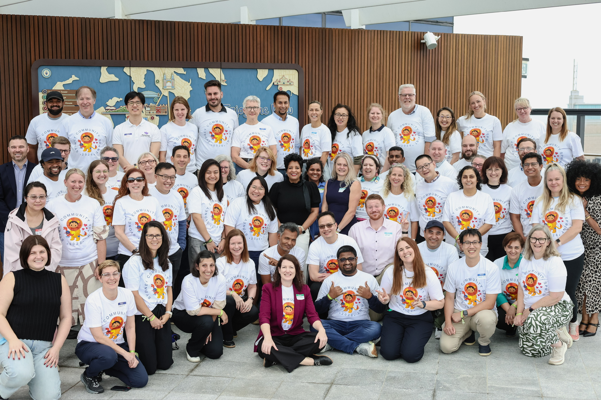
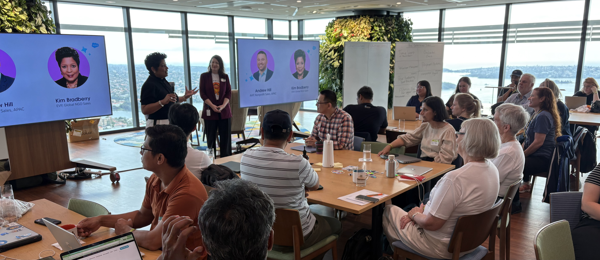
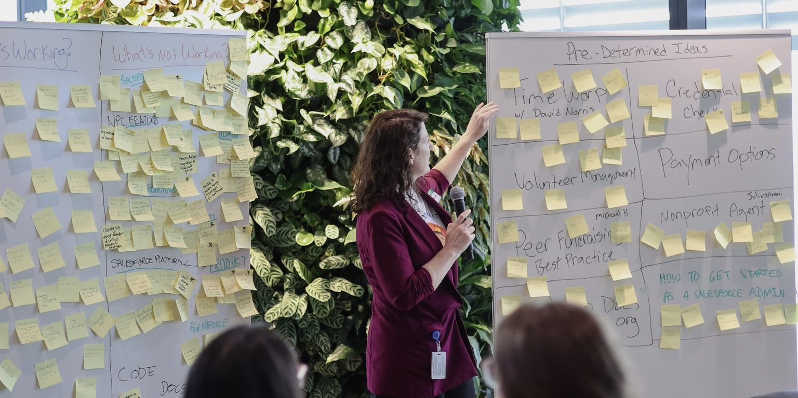
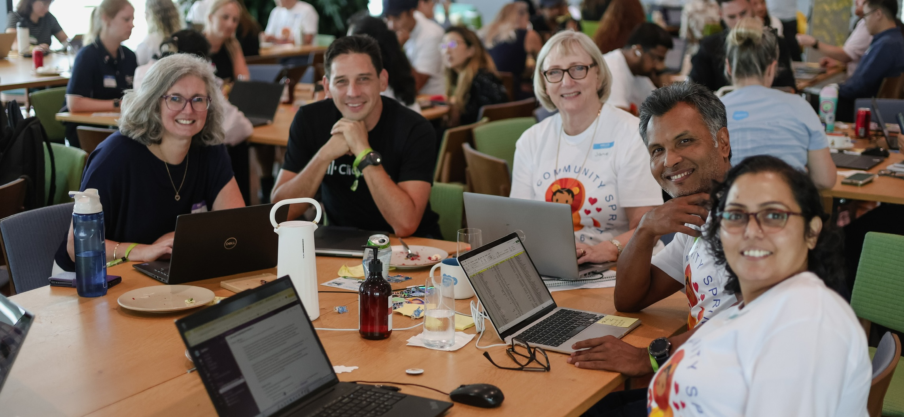
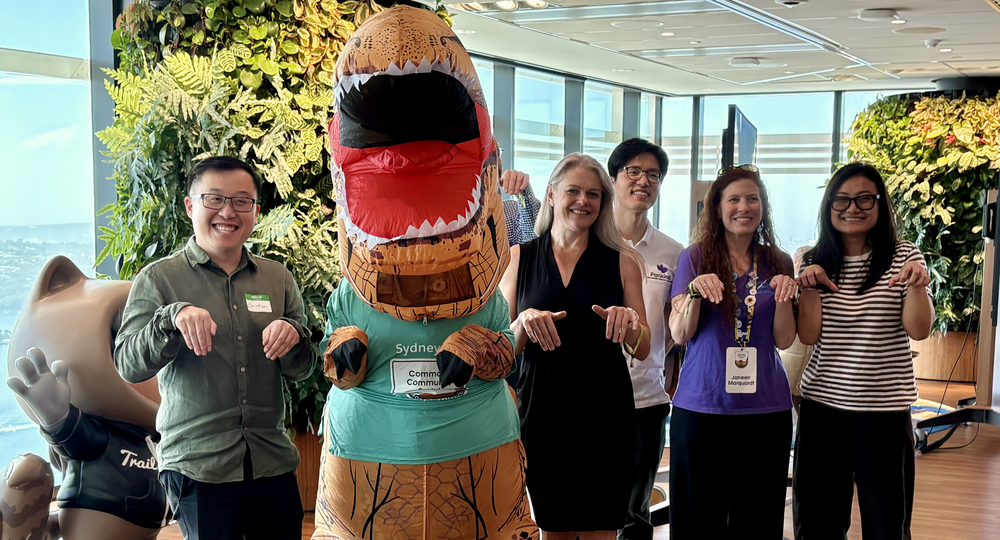

### Dates: April 30 and May 1, 2026

QUOTE

# NYC Community - Thank you for joining us at the Sprint!
80 attendees joined us in person for the 2-day Sprint, representing the local Nonprofit ecosystem - including end users, admins, developers, architects, and industry partners from the New York area and beyond.

To everyone who joined: thank you for carving out time during what we know is an already busy time of year. Your willingness to share your skills, insights, and energy made this event truly exceptional. We’re so grateful for your time and passion.

57% of the room were NEW sprinters (!) - and our returning leaders rose to the occasion beautifully, mentoring newcomers and creating the collaborative, welcoming atmosphere that defines our community. The combination of fresh energy from new faces and generous guidance from experienced sprinters made for an incredibly productive and inspiring two days.

_Group Photo! Sydney Sprint, Feb 2026_

## A Welcome from Salesforce Leadership 
After a lively networking breakfast, [Cori O'Brien](https://www.linkedin.com/in/coriobrienpaluck/) (Director, Commons Community) officially kicked off the day, sharing deep gratitude for the strength and dedication of this regional community. We had welcome remarks from [Kim Bradberry](https://www.linkedin.com/in/kimberly-smith-bradberry-93974212) (Chief Revenue Officer of Global Nonprofit Sales at Salesforce) and [Andrew Hill](https://www.linkedin.com/in/andrewrhill/) (Vice President, Salesforce for Nonprofits, Australia & New Zealand).

_Nonprofit Sales Leader, Kim Bradberry, welcomes our Nonprofit community to Sydney! Feb, 2026._

We then had a welcome from some leaders across Salesforce including [Kavindra Patel](https://www.linkedin.com/in/kavindrapatel/) (Head of Trailblazer Event Programs at Salesforce) and [Guilda Hildare](https://www.linkedin.com/in/ghilaire/) (Senior Director, Trailblazer Marketing).

Over lunch, we had a Nonprofit Roadmap overview from [Meg Grey](https://www.linkedin.com/in/meggray/) (Director of Product Management, Nonprofit) and [Jason Hinks](https://www.linkedin.com/in/jasonhincks/) (Industry Solutions & Strategy Director, Nonprofit). They shared an overview of the Nonprofit Roadmap coming this year and answered some live Q&A.

## Thanks to the Trailblazer Community Team!

Big shoutout to the Trailblazer Community Team, [Marissa Dimino Burns](https://www.linkedin.com/in/marissa-dimino/) (Director, Trailblazer Community) and [Gabriella Lacroix](https://www.linkedin.com/in/gabriella-lacroix-2a867293/) (Manager, Trailblazer Events) who joined our event to share insights on Trailblazer Programs and Events. They also hosted a fantastic Birds of a Feather conversation over lunch, where we dove into how our Nonprofit community can better engage with the User Group program, Trailblazers, MVPs, and beyond.

_Trailblazer Community team leading a Birds of a Feather lunch discussion on ways to engage in our wider community programs! February, 2026._

## Let’s Sprint!

After breakfast and intros, it was time to get to work. Attendees had the option to join 1 existing project and 6 brand-new projects on the spot. Collaboration kicked off quickly, with creative energy flowing.

_The morning innovation session (stickies galore!), grouping challenges into themes to organise potential projects, February 2026._

After a quick round of project identification based on prioritized challenges they are faced with today, attendees moved around the room to join the projects that resonated most with their interests and expertise. Collaboration was officially underway - and the creative energy was palpable.

## Check out the 7 community-led projects that participated:

_In alphabetical order_

* Credential Check
* Nonprofit Admin Journey Documentation Updates (Get Started)
* Nonprofit Data Quality Agent
* Org DNA App for Admin Documentation
* Peer to Peer Fundraising Best Practices
* Time Warp
* Volunteer Management Enhancements for AFNP Asset Hub

## 1. Credential Check

The Credential Check project helps nonprofits manage security and information checks (like working with children checks, police checks, and driver's licenses) for multiple people and match qualifications to roles. This project started in 2024 and has evolved from a specific working-with-children focus to a generic credential verification system that can be used across different credential types.

Work performed at the Sprint:
* Refined the data model architecture with three main objects: Credential Type (master template), Credential (specific instances), and Credential Request (tracking request lifecycle).
* Created detailed project specification including an unauthenticated Experience Cloud submission flow using unique tokens for secure document collection.
* Built and tested the MVP, deployed bug fixes, and tightened the final scope for the proof-of-concept.
* Documented and committed all key components to the GitHub repository with implementation guidelines.

Next Steps:
* Build Lightning Pages and Flows based on the finalized specification
* Continue virtual collaboration to complete the proof-of-concept build
* Follow documented next steps in the project repository

Team members: Sam Clifton, Justine Mathieson, Gourav Sood, Ashish Maharjan, Kristyna Turner, Jennifer Cains, Justin Yoon, Jerry Huang, Katie Connors, Jeremy Fahey

Learn more about this project: [GitHub Repository](https://github.com/SFDO-Community-Sprints/au-credential-check) | [Lucid Chart Process Map](https://lucid.app/lucidchart/95b4db3b-3e96-47b4-b2df-b3bed63c4a16/edit?viewport_loc=812%2C-4164%2C2915%2C2084%2C0_0&invitationId=inv_affb3449-269f-41d4-83cc-2ecc09f5061a)

## 2. Nonprofit Admin Journey Documentation Updates
This project focuses on updating and enhancing resources for nonprofit accidental admins, particularly beginners working with established orgs. The team is revamping the Agentforce Nonprofit (formerly Nonprofit Cloud) Recommendation Map and creating curated Trailhead learning paths that address the most common day-to-day admin tasks like user management, data hygiene, reporting, and page layout customization.

Work performed at this sprint:
* Reviewed existing Nonprofit documentation and restructured the flow into targeted categories: What's Your Role, Level of Salesforce Experience, and Which Nonprofit Solution You're Using.
* Identified Top 10 common admin tasks (User & Access Management, Data Model Understanding, Basic Data Management, Reporting for Leadership, Page Layout & Field Changes, and Security 101) and mapped each to relevant Trailhead modules, help articles, and enablement materials.
* Created comprehensive resource compilation linking Trailhead trails, Salesforce Help articles, Admin Skills Kit, and best practice documentation for each task-based learning pathway.
* Enhanced and formatted the Map content using Salesforce branding and prepared presentation deck for future Nonprofit User Group feedback sessions.
 

Next steps:
* Present updated documentation to the Nonprofit Salesforce team for review
* Publish to Trailblazer Community Group in place of the outdated recommendation map
* Create a new Trailmix featuring curated learning paths for the Top 10 admin tasks

Team members: Josh Girle Bennett, Karen Hendrickx, Maria Wigan, Michael Williams, Toni Tsang

## 3. Nonprofit Data Quality Agent

This project focuses on building an AI Agent that ensures data quality, completeness, and consistency across nonprofit Salesforce instances. The team identified a critical need shared across marketing, fundraising, counseling, compliance, IT, and service desk operations: ensuring that CRM data is correct, consistent, complete, non-duplicated, up-to-date, and compliant with regulatory requirements like NDIS/Healthcare standards.

Work performed at this sprint:
* Defined comprehensive requirements for a "Data Quality & Compliance Audit Agent" with user stories covering correct, consistent, complete, non-duplicated, and fresh data with time-based review triggers and validation checks.
* Developed detailed agent specifications focusing on four key data quality issues: duplicated data, incomplete data, incorrect data, and inconsistent data, with specific criteria, actions, and remediation workflows for each scenario.
* Established governance guardrails ensuring no data leaves the organization, human-in-the-loop approval on every action, clear audit trails, and explainable recommendations based on defined sources of truth.
* Created example scenarios including agent assessment criteria for record completeness checks, remediation options (auto-update from related records or assign review tasks), and notification workflows for account managers.

Next Steps:
* Build the sample Data Quality Agent based on finalized specifications
* Implement human review workflows with task assignment and notification features
* Test agent actions including assessment rules, remediation flows, and update logic

Team members: Julius Anuari, Oliver Rynn, Charmaine Lima, Christian Wong, Zohreh Vahedikamal, Matthew King, Noah Zheng, Harsha Kapilarathna, Janeen Marquardt, Bob Croft, Michelle Coleborn, Nicole Caldwell, Ammon Ho

## 4. Org DNA App for Admin Documentation
The Org DNA App will help certified Salesforce administrators, consultants, and freelancers quickly get up to speed when joining a new nonprofit org. The tool bridges the gap between being certified and being productive by surfacing local customizations, installations, clouds, and licenses that aren't always obvious—helping users avoid breaking existing configurations with new changes. Unlike existing tools like OrgCheck (which drowns users in data), Org DNA focuses on what you need to know to be productive immediately.

Work performed at the Sprint:
* Scanned existing AppExchange solutions (OrgCheck, Elements Cloud, Org Scanner, oAtlas) and determined focus on customization intelligence rather than just health scoring, providing context for new admins to get up to speed quickly.
* Agreed on scope and target audience: certified admins, consultants, and freelancers working in nonprofit orgs using common clouds (Sales, Service, CPQ, Experience Cloud, NPSP, Nonprofit Cloud).
* Documented comprehensive app specifications covering 4 major domains: Org Footprint & Licensing Health, Security & Access Model Health, Customisation & Metadata Complexity, and Technical Debt & Risk Indicators with detailed developer specs for each area.
* Designed AppExchange listing example and began discussing UI/UX for dashboard with drill-down capabilities, sortable tables, and PDF/JSON export functionality.

Next steps:
* Publish app specifications to gather feedback or interest from other community members
* Trial ideas to develop a proof of concept using Tooling API, Metadata API, and REST API
* Continue to meet and discuss at future sprints

Team members: Lydia Sharpin, Meagan Marden, Lilan Dangol, Noriko Murakami, Zhihan Lin, Ayoe Kristensen

## 5. Peer to Peer Fundraising Best Practices
This project published [comprehensive documentation and best practice guidance](https://sfdo-community-sprints.github.io/docs/Commons%20Solutions/launched/The-Power-of-Peer-Advice-All-You-Need-to-Know-About-P2P-Fundraising/#the-power-of-peer-advice-all-you-need-to-know-about-p2p-fundraising) for nonprofits implementing peer-to-peer (P2P) fundraising strategies in Salesforce. P2P fundraising empowers supporters to raise money on behalf of nonprofits by leveraging their personal networks, whether through structured events like walks and runs or DIY campaigns tied to personal milestones. The team documented how to effectively model and manage these campaigns in both NPSP and Agentforce Nonprofit (formerly Nonprofit Cloud). [Check it out](https://sfdo-community-sprints.github.io/docs/Commons%20Solutions/launched/The-Power-of-Peer-Advice-All-You-Need-to-Know-About-P2P-Fundraising/#the-power-of-peer-advice-all-you-need-to-know-about-p2p-fundraising)!

Work performed at the Sprint:
* Defined key differences between Traditional P2P (organization-led, event-driven campaigns with teams) and DIY Fundraising (supporter-driven, personal milestone campaigns) with clear examples and characteristics for each model.
* Documented campaign hierarchy structure for both models using Parent/Child campaigns, including how to track teams, individual fundraisers, registrations, goals, and soft credits in NPSP/Nonprofit Cloud.
* Compiled best practice recommendations including platform integrations with CRM and email systems, visual indicators on contact records, dashboards for tracking individual fundraising performance, and task lists for internal relationship management.
* Published the comprehensive knowledge article live to the community: [The Power of Peer Advice - All You Need to Know About P2P Fundraising](https://sfdo-community-sprints.github.io/docs/Commons%20Solutions/launched/The-Power-of-Peer-Advice-All-You-Need-to-Know-About-P2P-Fundraising/#the-power-of-peer-advice-all-you-need-to-know-about-p2p-fundraising).

Next Steps:
* Complete the regional integration sections for AMER and EMEA platforms at upcoming Sprints.

Team members: Brittany Neale, Kumari Smita, Uttam Tajhhy, Jane Ruston, Laura Branden, Julian Virguez

Learn more about this project: [The Power of Peer Advice - All You Need to Know About P2P Fundraising](https://sfdo-community-sprints.github.io/docs/Commons%20Solutions/launched/The-Power-of-Peer-Advice-All-You-Need-to-Know-About-P2P-Fundraising/#the-power-of-peer-advice-all-you-need-to-know-about-p2p-fundraising).

_Peer to Peer Fundraising Group Photo, Feb Sprint, 2026_

## 6. Time Warp
Time Warp is an open source Salesforce Labs AppExchange package that provides a visual timeline component for Salesforce Lightning pages, allowing users to see related records plotted chronologically across standard and custom objects. Led by David Norris,the team is conducting a comprehensive documentation review to improve clarity, accuracy, and usability of the configuration guide for system administrators implementing Time Warp across various nonprofit use cases.

Work performed at the Sprint:
* Completed comprehensive update of the Time Warp Configuration Guide documentation, which is now live on the AppExchange site with improved clarity, updated screenshots, and enhanced navigation.
* Translated all Time Warp content into multiple languages including Portuguese, Spanish, Italian, Hindi, Danish, Chinese Traditional, and Chinese Simplified to increase accessibility for global users.
* Updated AppExchange listing materials including new video demonstration and refreshed images and logos to better showcase the app's capabilities.
* Identified and addressed four bug fixes documented on GitHub, along with exploring Agentforce for setup assistance and testing code assistants to speed up development.

Next steps:
* Complete minor formatting edits to documentation
* Explore new setup wizard functionality
* Continue virtual collaboration on future enhancements

Team Members: Apurup K, Heather C, Bethany Smith, Rose W, Irene Sutherland, Viviane Piccinini, Kayleigh Rumbelow, Jeremy F, Craig D, Jodie M, with project lead Dave Norris.

Learn more about this project: [Time Warp on AppExchange](https://appexchange.salesforce.com/appxListingDetail?listingId=a0N4V00000GXVf4UAH).

## 7. Volunteer Management Enhancements for AFNP Asset Hub
This project focuses on enhancing the Agentforce for Nonprofits (AFNP) Asset Hub documentation for Volunteer Management, which helps nonprofits understand and implement the Volunteer Management data model when migrating from NPSP or adopting Nonprofit Cloud. The team is creating practical guidance, data model comparisons, case studies, and best practice documentation to support nonprofits in managing volunteers effectively using the new Volunteer Management features.

Work performed at the Sprint:
* Developed comprehensive data model comparisons between NPSP Volunteers for Salesforce (V4S) and Nonprofit Cloud Volunteer Management showing object relationships, field mappings, and migration recommendations with detailed visual documentation.
* Created detailed use case documentation with step-by-step guidance for multiple scenarios including gala event volunteer management setup, Board of Directors tracking, and program enrollment volunteer linkages with example records for each object.
* Designed white-label volunteer portal mockups with clickable prototypes showing login flows, signup processes, and object relationships to help nonprofits visualize volunteer self-service experiences.
* Documented gaps, gotchas, and best practices for Volunteer Management including reporting recommendations and workflow for managing multiple applications for job positions.

Next steps:
* Submit documentation to NPC Best Practices team for review and publication to Asset Hub
* Update existing Trailhead modules with new Volunteer Management translations
* Deploy data processing engine for Volunteer Initiative stats as a standard component

Team members: Zarina Varley Scott, Michael Humphrys, Nirvik Mitter, Melissa Shepard, Jason Lawrence, Kirsten Finger, Danny Bertogna, Thiriyambaga Sarma Sothinathan

**Learn more about this project:** [AFNP Asset Hub - Volunteer Management](https://sfdo-community-sprints.github.io/npc-best-practices/npsp-to-npc-translations/Volunteer%20Management/) | [Data Model Comparison](https://docs.google.com/presentation/d/1qUoIacIeYkDTWGnIv06wUwOg5XhNOuehvfMZ1J3VBkE/edit?usp=sharing) | [Volunteer Portal Prototype](https://xd.adobe.com/view/18f955c2-e732-41a5-adae-5b07af2c13f4-4daa/) | [Documentation & Best Practices](https://docs.google.com/document/d/12lEs0Nhjd_OOoT-xl0RKmQWeDwnl9Fk8RuyMKUF4X6E/edit?usp=sharing).

_Sprinty Group Pic! Feb 2026_

## We even had a visit from Sprinty himself!
WOW - what an incredible amount of work to get done in just. two. days. We’re constantly amazed by the brilliance, generosity, and grit this community brings, and this Sprint was no exception. You came ready to build, collaborate, and solve real challenges together. We're so impressed by what was accomplished in just a few hours.

But wait… we had one more surprise up our sleeves.

Sprinters get their Astro Sprinty Plushies!
Last year in 2025, to celebrate **[10 years of Community Sprints](https://www.linkedin.com/pulse/celebrating-10-years-community-sprints-heartfelt-thank-cori-o-brien-rxuic/?trackingId=gEO4vrVOTy2qBCpMP57UHQ%3D%3D)**, we revealed the **limited-edition [Sprinty](https://sfdo-community-sprints.github.io/docs/sprints/2024/2024-03-2021-Sprint/) plushie costume**! That's right, our community dinosaur now has an **Astro-sized outfit** so you can take him along for your next adventure.

Tag your photos with #AstroSprinty to share where the community takes you! Our Sprinters received their Astro Plushies and even a visit from (big) Sprinty himself! 

_Sprinters with Sprinty! Feb, 2026._

## THANK YOU to our Tech Mentors, PMs and volunteers! 

None of this incredible work would have been possible without our amazing support system. 

Thanks to our incredible guest speakers, tech mentors, product managers, volunteers: 
Kim Bradberry, Andrew Hill, Kavindra Patel, Marissa Burns, Gabby Lacroix, Judy Fang, Kelly Wong, Charles Pinckney, Brenda Wai, Chris Tye, Geovanna Pazmino, Builda Hildare, and David Norris who spent two days contributing on projects directly! 

Thank you for giving your time, sharing your skills, and embodying the spirit of Ohana that makes our Salesforce community so special. Events like these simply wouldn't happen without support from teammates like you!

# What’s next?
PHEW! That was a lot! So much innovation is taking place. But it doesn’t stop here! 

## Register or save the date for our upcoming events:
* March 26 - [Community Breakfast](https://nonprofitewelcomebreakfast.splashthat.com/) at World Tour DC
* April 30-May 1 - Community Sprint at World Tour NYC, _save the date_
* …and more to come as we get more confirmed!

Join the [Commons & Sprint group in the Trailblazer Community](https://trailhead.salesforce.com/trailblazer-community/groups/0F94S000000GwVKSA0) and be the first to hear about where we’ll be Sprinting next.

## Let's Stay Connected
* Follow our [LinkedIn page](https://www.linkedin.com/feed/update/urn:li:activity:7420229523469819904): Salesforce Nonprofit Community
* Join and follow the [Nonprofit Trailblazer Community](https://www.salesforce.com/nonprofit/trailblazer-community/) if you aren't already a member!

See you soon! Nonprofit Community Team ([Cori O’Brien](https://www.linkedin.com/in/coriobrienpaluck/), [Lizzy Roberts](https://www.linkedin.com/in/lizzyroberts/), & [Natalie Larino](https://www.linkedin.com/in/natalie-larino/))

