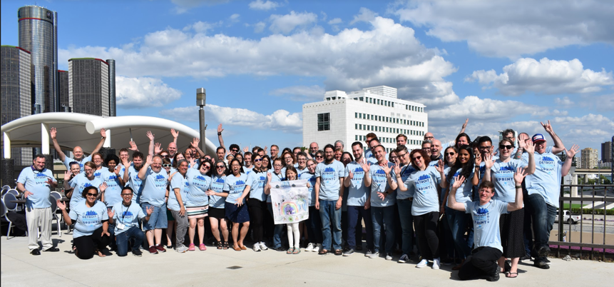

# What's an Open Source Community Sprint?

*It's all about our amazing community!* It goes way beyond the Power of Us Hub. 
During the event, the community of admins, implementation partners, app partners, 
and developers will come together with a common goal of making the ecosystem around 
our open source products better for everyone else (lots of laughs and caffeine included too).

The goal of the Community Sprint is simple: making the most of *your* contribution. 
Create something impactful that can be shared with everyone in some capacity. 
It's an [unconference](https://en.wikipedia.org/wiki/Unconference) format style event. 
What exactly that contribution is depends on who is attending and what skills they bring. 

