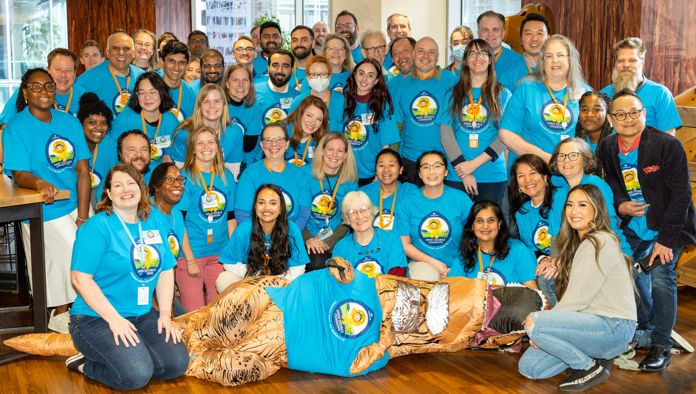

# Ideate. Create. Share. Learn more about Community Sprints

## Upcoming Events:
- Global Virtual Sprint, September 26th & 27th, 2024 - [Register now](https://invite.salesforce.com/virtualcommonscommunitysprint?_ga=2.189178349.754051089.1725906922-1372063299.1725906922)
- Commons Affordable Housing Sprint, Newcastle upon Tyne, October 7th & 8th, 2024 - [Register now](https://commonsaffordablehousingsprint-0a85.splashthat.com/)
- Commons Community Sprint, November 13th & 14th, Chicago, IL - Save the date!

Community Sprint Events are about coming together to collaborate with organizations like yours to build solutions to address everyday challenges. By attending a Sprint, you'll come together in person, virtually, and via Slack to work on projects that are important to you and will make a real difference for Nonprofits and Schools using Salesforce technologies.

When you attend a Sprint event, expect to spend your time working alongside other Salesforce.org community volunteers (Customers, Partners, and Employees) on specifc goals prioritized by the community. Over 90% of participants say they learned new skills by participating!

We regularly host two-day **Community Sprint** events, either in-person or virtually about 3 times per year (since 2015!), where up to 150 Sprinters work on a variety of projects at the same time. We also host **Mini-Sprint** events, which are smaller one-day virtual events where 10 - 30 Sprinters focus their time on one specific project.

# Who participates at Community Sprint Events?
Anyone can join in the fun - you don't need to be a developer! In general, we encourage all those that work within the Salesforce ecosystem (Customers, Partners, and Employees) who have an interest in helping build technology solutions to make using Salesforce easier for Nonprofits and Schools. This means you'll be rolling up your sleeves wtih other Admins, Developers, End Users, Consultants, and Salesforce Employees.

## Can I still attend if I know nothing about writing code or using Github?

Absolutely! Bringing an idea to life takes much more than just a skilled developer and there are so many ways to contribute to a Community Sprint that has nothing to do with writing code. The beauty of a Community Sprint is that we all come together to work toward the same goal. You can help define use cases and best practices or help to simplify hard-to-grasp concepts. You can share your organization's story and how you use the products. You can write new or improve an existing product or best practice documentation, write or edit scripts for upcoming NPSP videos, or even help test a new tool. Your level of coding or configuration experience is not a barrier!

[Check out](https://github.com/SFDO-Community-Sprints/sfdo-community-sprints.github.io/blob/2497c976b4ce0b60feec397eb253a8e93b08eedd/assets/Commons%20Community%20Team%20Roles.pdf) the different types of roles and activities that happen at a Community Sprint.

# What will I work on at the event?

It’s up to you! At the Sprint, you will be given an opportunity to work with an existing project team, as well as identify current challenges faced by the Nonprofit and Education community and prioritize those that you think the community should swarm around to find a solution. 
When deciding what project to work on at the event, you can choose to contribute your skills to a new project spun up from this activity, or to an established project team that is continuing to work on solutions for pre-determined challenges. Over 90% of participants say they learned new skills by participating!

# What support is given to new Sprinters?

A LOT! Generally, we welcome approx. 50% new Sprinters each time we host an event, so we're very experienced in making sure everyone who attends feels like they can contribute and understands what to expect whether it's an in-person or virtually hosted event. 

Some examples of what you can expect to participate in are:
- Event Slack channel to promote pre-sprint conversation, info shares, and fun
- A Know-Before-You-Go pre-event webinar
- Sprint Buddy program to match you up with an experienced Sprinter
- Detailed FAQ and other support materials
- Suggested ways to ready your computer and create an appropriate Salesforce environment for testing, taking screenshots, etc.

# Why should I attend a Community Sprint Event?
*"The opportunity to grow our understanding of best practices and how people are pushing the boundaries of this platform is incredibly valuable" 
Toby Ward - Senior Salesforce Consultant, Galvin Technologies*

First off, it’s fun! But it’s also a great way to connect with other Salesforce users, admins, employees in person, and learn more about community built solutions that help Nonprofits and Schools use Salesforce more effectively. Here are 5 reasons why you should attend (and very helpful if you need to ask for permission to attend):

1. **Professional development**: Expand your knowledge of what’s possible to accomplish in Salesforce and with Salesforce.org products. Sprints put you in the room with other Nonprofit and Education admins and developers, and Consulting Partners that use the same technology to solve challenges that all organizations face. There is simply no better learning and problem-solving opportunity available at any price. In fact, over 90% of Commons and Sprint participants report an increase in professional development. 

2. **Connect with local Salesforce Community and Salesforce Employees**:
Networking: Get to know nonprofit and higher-ed Salesforce administrators, developers, architects, consultants, Salesforce employees, and other experts in a setting where you are not passively absorbing information, but rather, actively working together. After participating in the Commons program and Sprint events, 95% say they feel better connected to other members of the Salesforce community.
Engage with Trailblazer Community in person: It’s easier to troubleshoot Salesforce challenges when you’re not alone. At the Sprint, you’ll meet other admins and end-users, including those you’ve come to know virtually or via the Trailblazer Community, Twitter, Stack Exchange, etc.. This translates to direct value for nonprofit organizations so that when the “going gets tough” you can “phone a friend” for help or advice.

3. **Find existing solutions to reduce inefficiencies and implementation costs**: By connecting with other participants, you’ll be exposed to solutions already in progress by the global Commons community. You can expect to learn about existing solutions you can bring back to your organization today, such as Grassroots Mobile Survey for collecting data in the field, Nonprofit Salesforce How-To Series videos on YouTube, or Declarative Lookup Rollup Summaries which is used by over 23,000 Salesforce customers to roll-up Salesforce data across non parent/child objects. In a recent survey, 96% of participants feel that solutions created by the Commons program foster greater efficiency and improve how work gets done in the Nonprofit and Education sectors.

4. **Your skills are needed**: Sprint events are a way to leverage the collective knowledge of the community for impact that is “greater than the sum of our parts.” Since 2015, over 2000+ global community members have participated at more than 40 Sprint events, contributing hundreds of resources and solutions. When you attend the Sprint, you’ll bring your Salesforce and professional skills to create solutions for common problems faced by other Nonprofits and Schools, that are then shared back into the community. This helps other Nonprofit organizations and Schools see real impact via their investments in Salesforce. All skills are needed and everyone is welcome to attend!

5. **Unique hands-on interaction**: Community Sprint events have been held in America approx 3 times a year since 2015, and are very popular. We typically host 100 - 150 participants (pre-covid), the January London Sprint is the first opportunity for the EMEA community to experience a two-day full Community Sprint event in person. You don’t want to miss it - this is not a sales conference but a *hands-on* conference.  Your time will be spent “in the platform” rather than watching presentations and speakers. There’s a lot less “take my word for it” and MUCH more “let me show you!” Think workshop not webinar.

# How can I find upcoming events?

Easy! You can stay in the know about all upcoming events by joining us on the Trailblazer Community, following on social channels, and right here on this site! Just look at the navigation menu on the left to see both upcoming and past Sprint events, including updates on how the event went or registration info. 
- [Join the Trailblazer Community Group](https://trailhead.salesforce.com/trailblazer-community/groups/0F94S000000GwVK#discussion)
- Follow Cori O'Brien (Director, Commons & Nonprofit Community) on [Twitter](https://twitter.com/CoriOPaluck) and [LinkedIn](https://www.linkedin.com/in/coriobrienpaluck/).

