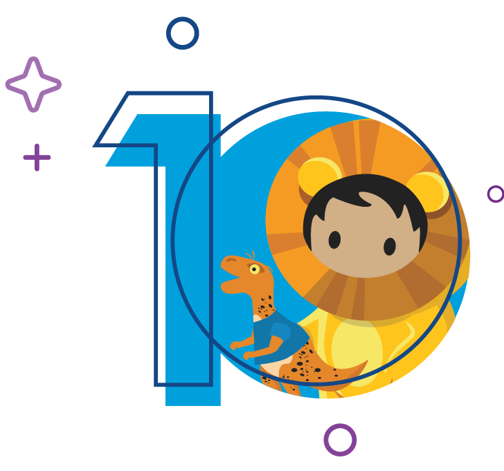
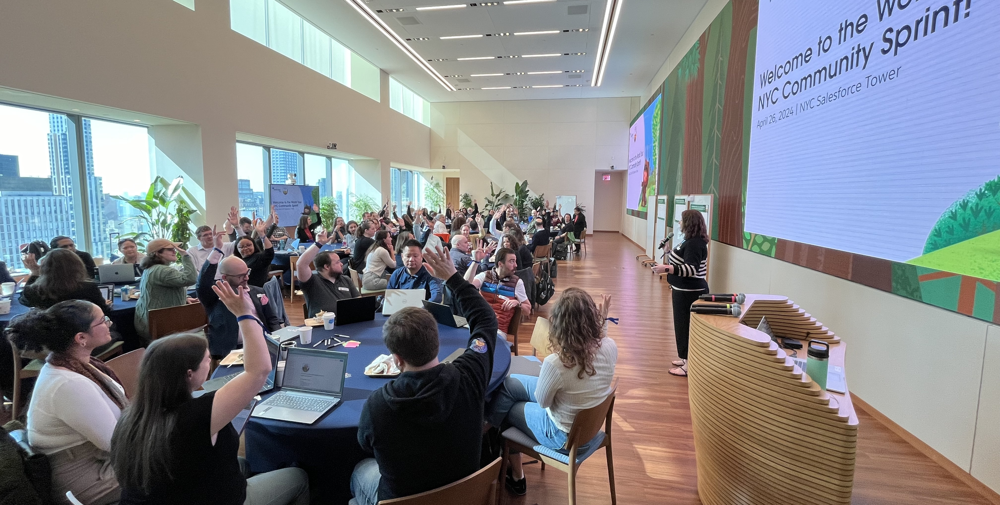
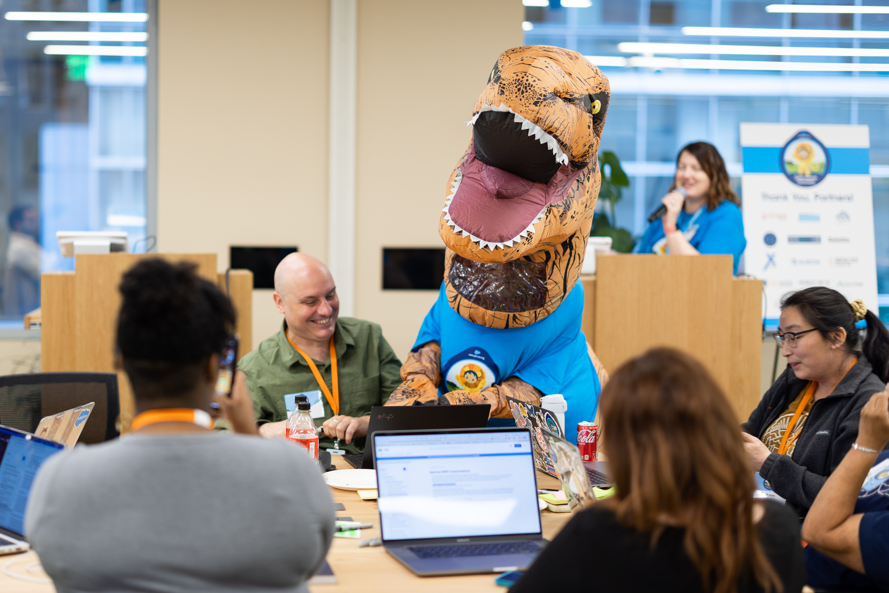

# Welcome to the Open Source Commons! 
The Commons program provides a platform for our community to address technology challenges in the Nonprofit and Education sectors through open source Salesforce innovation, but it’s so much more than that. Through Community Sprint events, like hack-a-thons, and other engagement spaces like Slack, our Nonprofit community defines challenges and builds open-source solutions to share with each other. For almost 20 years, Nonprofit Trailblazers just like you have contributed their Salesforce and professional skills to help solve common challenges, so that others could see more success with the power of Salesforce. Today, the Commons Community team continues that legacy, and drives impact through mentorship and learning opportunities.

## Get Involved at a Community Sprint
It's the 10th anniversary of Community Sprinting! What’s a [Community Sprint](https://sfdo-community-sprints.github.io/docs/sprints/)? Originally starting in America in 2015, Community Sprints are the meet-ups (either in-person or virtually) portion of the Salesforce Commons Program, where we gather our engaged community of Customers, Partners, and Salesforce employees for 1-2 days of challenge discussion, solution brainstorming, and getting hands-on to build impactful Salesforce solutions to solve common day to day technology challenges that affect Nonprofit organizations and Schools. We do this by actively listening to each other, educating each other, and bringing our passion, Salesforce and professional experience, and technical know-how to projects that can be dreamed up, built by the community (you!), and then shared as open source solutions throughout the Salesforce ecosystem.

Learn more about Community Sprints:
- [What are Community Sprints?](https://sfdo-community-sprints.github.io/docs/sprints/#what-are-community-sprints)
- [Who participates at a Sprint?](https://sfdo-community-sprints.github.io/docs/sprints/#who-participates-at-community-sprint-events)
- [What will I work on?](https://sfdo-community-sprints.github.io/docs/sprints/#what-will-i-work-on-at-the-event)
- [Convince your Boss](https://sfdo-community-sprints.github.io/docs/sprints/#why-should-i-attend-a-community-sprint-event)
- [Find an upcoming Sprint event to join](https://sfdo-community-sprints.github.io/docs/sprints/#upcoming-community-sprint-events---join-in-the-fun-today)

Celebrate 10-year's of Sprinting in 2025! There’s never been a more exciting time to engage to build community-led resources, apps, and solutions on top of the world’s #1 CRM. Find an [upcoming event](https://sfdo-community-sprints.github.io/docs/sprints/) and join us today!

## Find a Solution or Resource to solve a common challenge

TBA - Catalog coming soon!

## Meet Sprinty, the Commons Community Mascot!

Sprinty the T-Rex is the official community mascot of the Commons program and specifically our Community Sprint events. Sprinty (pronouns He/Him) represents inclusivity, comradery, and a can-do attitude. He has been a favorite member of the Sprinting community since 2016 when his dear friend Jace Bryan, then a member of the Salesforce.org Open Source Community team, invited him to the Harvard Community Sprint to highlight that the the Commons is a place where everyone is welcome, even a T-Rex! Sprinty was an instant hit in the community, and became a much anticipated attendee at each Sprint. In order to ensure there were no issues with an unofficial "character", Jace worked wtih the community members in the US to transition the beloved mascot to a community volunteer - which is why we call Sprinty our "Official Community Mascot". 

In the years since, Sprinty continues to join in the fun at Community Sprint events all over the world (he is worn by different regional members of the community most of the time), and motivates Sprinters to keep up their amazing work. If you get a chance to meet Sprinty, be sure to grab a hug, a coveted photo, or a high five from him!

You'll find fun images of Sprinty on most of the materials we create for the Commons and Community Sprint events. As you may already know, the character Astro Lionheart is the Salesforce mascot for our Nonprofit products, and a few years ago the amazingly fun and passionate [Domenique Sillett Buxton](https://www.linkedin.com/in/domenique-sillett-buxton/), (then Senior Creative Director, Characters, Culture, and Trailhead at Salesforce), drew a special graphic of Lionheart holding a Sprinty stuffie to help us promote our unique friend. The history here is that for years and years the Sprinting community had been begging us to try and get Sprinty made into his own stuffie, which wasn't possible unfortunatly, but we now had a very cute Salesforce character version of our inflatable T-Rex mascot.

We celebrate Sprinty as many ways as we can as program leaders. While he might have started as a employee initiative, he's now very much owned by the Community!

